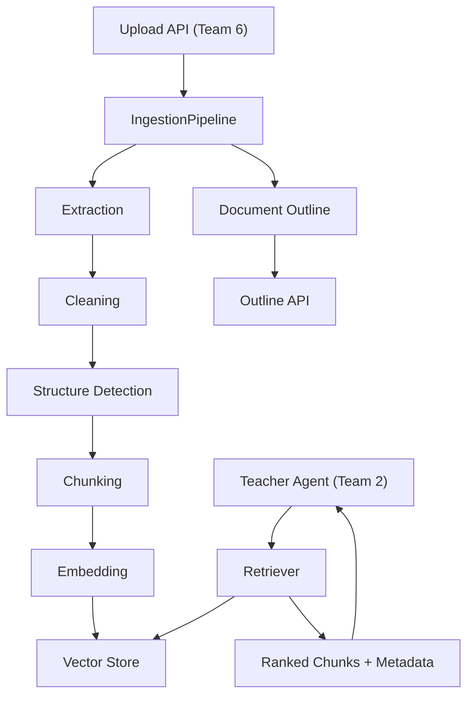

# Team 1 — RAG & Educational Material Engineer

## 1. Role / Mission

Build the document ingestion and retrieval-augmented generation (RAG) pipeline that enables the AI Teacher to teach from uploaded educational materials. You are the **grounding layer** — without your work, the Teacher Agent cannot reference real documents and risks hallucinating.

## 2. Scope

### What you OWN

- File upload validation and storage
- Text extraction from PDF, DOCX, PPTX
- Document structure detection (chapters, sections, headings)
- Text cleaning and normalization
- Chunking strategy
- Embedding generation
- Vector store indexing
- Semantic retrieval (query → relevant chunks)
- Document outline generation
- Source metadata preservation

### What you do NOT own

- API route definitions (`backend/app/api/documents.py`) — Team 6
- Database models for documents (`backend/app/models/document.py`) — Team 6
- How retrieved context is used in lesson planning — Team 2
- Frontend upload UI — Team 5

### Dependencies

| Dependency | Provider | What you need |
|---|---|---|
| Upload API route | Team 6 | `POST /api/documents/upload` calls your `IngestionPipeline` |
| Document DB model | Team 6 | Persists `document_id`, filename, status, metadata |
| LLM API key | Team 6 | For embedding generation via `settings.EMBEDDING_API_KEY` |
| Vector DB connection | Team 6 | Connection config via `settings.VECTOR_DB_URL` |

## 3. Mandatory Tasklist (P0)

### Document Input

- [ ] Validate file type (PDF, DOCX, PPTX only) before processing
- [ ] Validate file size (reject files > 50 MB)
- [ ] Generate unique `document_id` (UUID)
- [ ] Save raw file to `data/uploads/{document_id}/`
- [ ] Store file metadata (filename, type, size, upload timestamp)
- [ ] Set initial status to `uploaded`

### Text Extraction

- [ ] Extract text from PDF preserving page numbers (`extraction.py`)
- [ ] Extract paragraphs and headings from DOCX with structure tags (`extraction.py`)
- [ ] Extract slide text from PPTX with slide numbers (`extraction.py`)
- [ ] Handle empty/corrupt files gracefully (return error, do not crash)
- [ ] Clean headers, footers, page numbers, and excessive whitespace (`cleaning.py`)
- [ ] Normalize Unicode characters
- [ ] Update status to `extracted`

### Structure Detection

- [ ] Detect chapter/section headings from formatting cues (font size, bold, numbering)
- [ ] Build a document outline: `{ title, sections: [{ heading, page }] }`
- [ ] Identify definitions, examples, and key concepts where possible
- [ ] Store outline as JSON in the document record
- [ ] Update status to `structured`

### Chunking

- [ ] Chunk text into segments of 300–500 tokens (`chunking.py`)
- [ ] Overlap chunks by ~50 tokens to preserve context at boundaries
- [ ] Attach metadata to every chunk: `{ document_id, chunk_id, page, chapter, section }`
- [ ] Do not split mid-sentence
- [ ] Update status to `chunked`

### Embedding & Indexing

- [ ] Generate embeddings for each chunk using the configured embedding model (`embeddings.py`)
- [ ] Store embeddings in the vector store with metadata (`vector_store.py`)
- [ ] Create/use a collection named `ai_teacher_docs`
- [ ] Update status to `indexed`

### Retrieval

- [ ] Implement `search(query, document_id, top_k=5)` in `retriever.py`
- [ ] Return chunks with: `text`, `page`, `chapter`, `section`, `chunk_id`, `score`
- [ ] Filter by `document_id` when provided
- [ ] Return empty list (not error) when no relevant results found
- [ ] Set a minimum relevance threshold (score ≥ 0.5) to prevent garbage results

### Grounding Contract

- [ ] Every retrieved chunk includes source metadata (page, chapter)
- [ ] Retrieval response matches the `RetrievalChunk` type in `packages/types/document.ts`
- [ ] When document mode is active, retrieval results are the primary context for the Teacher Agent

## 4. P1 Important Tasks

- [ ] Hybrid retrieval: combine keyword search (BM25) with semantic search
- [ ] Reranking: use a cross-encoder or LLM reranker on top-k results
- [ ] Automatic chapter/document summaries for lesson planning overview
- [ ] OCR fallback for scanned/image-based PDFs (using `pytesseract` or similar)
- [ ] Multilingual embedding support (ensure Hindi documents work)
- [ ] Chunk deduplication (detect and merge near-duplicate chunks)

## 5. P2 Optional Tasks

- [ ] Image/table extraction from PDFs
- [ ] Multimodal document understanding (send images to vision LLM)
- [ ] Incremental re-indexing (update only changed pages)
- [ ] Document comparison (diff two versions)

## 6. Technical Architecture



## 7. Detailed Implementation Flow

### Ingestion Flow

```
File uploaded via API
  → Validate type + size
  → Save to data/uploads/{document_id}/
  → Extract text (PDF/DOCX/PPTX handler)
  → Clean text (remove noise, normalize)
  → Detect structure (headings, chapters)
  → Build document outline
  → Chunk text (300-500 tokens, 50 token overlap)
  → Generate embeddings (batch, ~100 chunks per call)
  → Store in vector DB with metadata
  → Update document status to "indexed"
  → Return document_id + outline
```

### Retrieval Flow

```
Query received from Teacher Agent
  → Generate query embedding
  → Search vector store (top_k=5, filter by document_id)
  → Filter results below score threshold (0.5)
  → Return chunks with source metadata
```

## 8. Technology Recommendations

| Technology | Role | Why | Replaceable? |
|---|---|---|---|
| **PyPDF2** | PDF text extraction | Already in `requirements.txt`, simple API | Yes → `pdfplumber` for better table handling |
| **python-docx** | DOCX extraction | Already in `requirements.txt` | No good alternative |
| **python-pptx** | PPTX extraction | Already in `requirements.txt` | No good alternative |
| **ChromaDB** | Vector database | Free, local, no server needed for MVP | Yes → Pinecone, Weaviate, Qdrant |
| **OpenAI `text-embedding-3-small`** | Embeddings | High quality, affordable ($0.02/1M tokens) | Yes → HuggingFace `all-MiniLM-L6-v2` (free, local) |
| **tiktoken** | Token counting | Accurate token counts for chunking | Yes → `transformers` tokenizer |

> **MVP recommendation**: Use ChromaDB locally. It requires no API key, no server, and is fast enough for a hackathon. Add it to `requirements.txt` as `chromadb>=0.5.0`.

## 9. Interfaces / API Contracts

### Service Functions (called by Team 6 API routes)

#### `ingest_document(file_path, document_id, filename, file_type) → DocumentOutlineResponse`

#### `search_chunks(query, document_id, top_k) → list[RetrievalChunk]`

#### `get_outline(document_id) → DocumentOutline`

### Retrieval Request (from Teacher Agent via internal call)

```json
{
  "query": "What is Ohm's Law?",
  "document_id": "doc_abc123",
  "top_k": 5
}
```

### Retrieval Response

```json
{
  "query": "What is Ohm's Law?",
  "chunks": [
    {
      "text": "Ohm's Law states that the current through a conductor is directly proportional to the voltage across it. V = IR where V is voltage, I is current, and R is resistance.",
      "page": 12,
      "chapter": "Chapter 4 — Electric Circuits",
      "section": "4.2 Ohm's Law",
      "chunk_id": "chunk_047",
      "score": 0.94
    },
    {
      "text": "Resistance is measured in ohms (Ω). It represents the opposition to current flow in a circuit.",
      "page": 13,
      "chapter": "Chapter 4 — Electric Circuits",
      "section": "4.3 Resistance",
      "chunk_id": "chunk_048",
      "score": 0.87
    }
  ]
}
```

### Document Outline Response

```json
{
  "id": "doc_abc123",
  "filename": "physics_textbook.pdf",
  "outline": {
    "title": "Physics Fundamentals",
    "sections": [
      { "heading": "Chapter 1 — Units and Measurement", "page": 1 },
      { "heading": "Chapter 4 — Electric Circuits", "page": 45 }
    ],
    "total_pages": 120
  },
  "status": "indexed",
  "chunk_count": 342
}
```

## 10. Data Structures

### ChunkMetadata (internal)

```python
class ChunkMetadata:
    document_id: str
    chunk_id: str          # "chunk_001"
    text: str              # 300-500 tokens
    page: int | None
    chapter: str | None
    section: str | None
    start_char: int        # position in original text
    token_count: int
```

### DocumentProcessingStatus

```python
# Progression: uploaded → extracting → extracted → chunked → indexing → indexed → error
STATUS_VALUES = ["uploaded", "extracting", "extracted", "chunked", "indexing", "indexed", "error"]
```

### Vector Store Collection Schema

```
Collection: ai_teacher_docs
- id: chunk_id (string)
- embedding: float[1536]  # or 384 for MiniLM
- metadata: { document_id, page, chapter, section, token_count }
- document: chunk text
```

## 11. Prompt / AI Design

This team primarily uses embeddings, not generative LLM prompts. However, two optional LLM uses exist:

### Structure Detection Prompt (P1 — for ambiguous documents)

```
Given the following extracted text from page {page}, identify:
1. Whether this is a heading, definition, example, or body text.
2. The section/chapter it likely belongs to.

Text: "{text}"

Return JSON: { "type": "heading|definition|example|body", "section": "..." }
```

### Validation

- Embedding API must return vectors of consistent dimension
- Chunk text must not be empty after cleaning
- Document outline must have at least one section

### Failure Handling

- If embedding API fails → retry 2x with exponential backoff → mark document as `error`
- If extraction returns empty text → set status `error` with message "No extractable text found"

## 12. Error Handling

| Failure | Response |
|---|---|
| Unsupported file type | Return 400 with "Unsupported file type. Accepted: PDF, DOCX, PPTX" |
| File too large (> 50 MB) | Return 413 with "File exceeds maximum size of 50 MB" |
| Corrupt/unreadable file | Set status `error`, return error message to frontend |
| Empty document (no extractable text) | Set status `error` with "No text content found" |
| Embedding API timeout | Retry 2x → set status `error` |
| Embedding API rate limit | Queue and retry with backoff |
| Vector DB connection failure | Log error, set status `error`, allow retry |
| Query returns 0 results | Return empty chunks array (not an error) |
| Chunk too short after cleaning (< 20 chars) | Skip chunk, do not index |

## 13. Testing Checklist

### Unit Tests

- [ ] PDF extraction returns text with page numbers
- [ ] DOCX extraction preserves paragraph structure
- [ ] PPTX extraction returns slide text with slide numbers
- [ ] Cleaning removes headers/footers/whitespace correctly
- [ ] Chunking produces chunks within 300-500 token range
- [ ] Chunks have ~50 token overlap
- [ ] No chunk splits mid-sentence
- [ ] Metadata is correctly attached to every chunk
- [ ] Structure detection identifies at least top-level headings

### Integration Tests

- [ ] Full pipeline: upload PDF → extract → chunk → embed → index → search → get results
- [ ] Full pipeline: upload DOCX → same flow
- [ ] Full pipeline: upload PPTX → same flow
- [ ] Retrieval returns relevant chunks for a known query
- [ ] Retrieval filters correctly by `document_id`
- [ ] Outline API returns valid structure

### Edge Cases

- [ ] Large PDF (100+ pages) completes without timeout
- [ ] PDF with no text (scanned image) returns meaningful error
- [ ] PPTX with only images returns appropriate status
- [ ] Query with no matching content returns empty array
- [ ] Simultaneous uploads do not conflict
- [ ] Unicode/multilingual content (Hindi, mixed scripts) preserved correctly

### End-to-End Test

- [ ] Upload a real educational PDF → retrieve a specific concept → verify source page is correct

## 14. Demo Requirements

During the hackathon demo, your pipeline must support:

1. **Upload a PDF** and show it being processed (status updates visible)
2. **Display document outline** (chapters/sections detected from the PDF)
3. **The Teacher Agent teaches from the PDF** — when the AI explains a concept, the retrieved context must come from the actual document
4. **Source attribution** — the UI should be able to show "Source: Page 12, Chapter 4"

You do NOT need to demo the upload flow yourself — Team 5 handles the UI, Team 6 handles the API. But your pipeline must work reliably behind the scenes.

## 15. Definition of Done

- [ ] PDF, DOCX, and PPTX files can be uploaded and processed without errors
- [ ] Document outline is generated and returned via API
- [ ] Text is chunked, embedded, and indexed in the vector store
- [ ] Semantic search returns relevant chunks with source metadata
- [ ] All retrieval responses match the `RetrievalChunk` schema
- [ ] Processing status updates correctly through the pipeline
- [ ] Error cases return meaningful messages (not stack traces)
- [ ] Unit tests pass for extraction, chunking, and retrieval
- [ ] Integration test passes for the full upload-to-search pipeline
- [ ] Hindi/multilingual document content is handled correctly

## 16. Handoff to Other Teams

| Artifact | Consumer | What they need |
|---|---|---|
| `IngestionPipeline.run(file_path, doc_id, ...)` | Team 6 | Called from `POST /api/documents/upload` handler |
| `Retriever.search(query, doc_id, top_k)` | Team 2 (via Team 6 API) | Returns `list[RetrievalChunk]` for lesson grounding |
| `get_outline(doc_id)` | Team 6 → Team 5 | Returns `DocumentOutline` for the material screen |
| `RetrievalChunk` schema | Team 2, Team 5 | Defined in `packages/types/document.ts` |
| Vector DB collection | Team 6 | Must be configured and accessible |

### Still Pending (coordinate with Team 6)

- Embedding API key configuration
- Vector DB deployment/hosting decision
- File cleanup/retention policy

## 17. Performance / Cost Considerations

| Concern | Mitigation |
|---|---|
| Embedding cost | `text-embedding-3-small` costs ~$0.02/1M tokens. A 100-page PDF ≈ 50K tokens ≈ $0.001. Negligible for hackathon. |
| Embedding latency | Batch embed chunks (100 per request). Full PDF indexing: 5–15 seconds. |
| Vector DB storage | ChromaDB stores locally. ~1 KB per chunk. 1000 chunks ≈ 1 MB. |
| Large file processing | Set 50 MB limit. Process asynchronously if > 30 pages. |
| Search latency | Vector search on <10K chunks: < 100ms. No concern for MVP. |

## 18. Security / Privacy

- Uploaded files are stored per `document_id` — do not expose raw file paths to the frontend
- Do not log extracted text content (may contain sensitive educational material)
- Validate file content matches extension (do not trust `Content-Type` alone)
- Sanitize filenames before storage (remove path traversal characters)
- Delete uploaded files and vector data when a document is deleted

## 19. Known Limitations

- **Scanned PDFs** with no selectable text will fail extraction (OCR is P1)
- **Tables and images** inside documents are not extracted in MVP
- **Very large documents** (500+ pages) may hit embedding API rate limits
- **Non-Latin scripts** in PDFs may have extraction issues depending on font encoding
- **Structure detection** is heuristic-based and may misidentify headings in some formats
- **No incremental updates** — re-uploading requires full re-indexing

## 20. Suggested Implementation Order

| Phase | Tasks | Est. Time |
|---|---|---|
| **Phase 1 — Extraction** | PDF/DOCX/PPTX extraction + cleaning + validation | 3-4 hours |
| **Phase 2 — Chunking** | Chunking logic + metadata tagging + structure detection | 2-3 hours |
| **Phase 3 — Vector Store** | Embedding generation + ChromaDB setup + indexing | 2-3 hours |
| **Phase 4 — Retrieval** | Search implementation + relevance filtering + outline API | 2-3 hours |
| **Phase 5 — Integration** | Wire up with Team 6 API routes + test end-to-end | 2-3 hours |
| **Phase 6 — Testing** | Unit tests + edge cases + multilingual test | 2 hours |

---

## Files to Create / Modify

```
backend/app/services/rag/
├── __init__.py          ← export public functions
├── extraction.py        ← PDF, DOCX, PPTX text extraction
├── cleaning.py          ← text cleaning and normalization
├── chunking.py          ← text chunking with overlap
├── embeddings.py        ← embedding generation
├── vector_store.py      ← ChromaDB collection management
├── retriever.py         ← semantic search
└── ingestion.py         ← orchestrates the full pipeline

backend/tests/
├── test_extraction.py
├── test_chunking.py
└── test_retrieval.py
```

---

## Instructions for AI Coding Assistants

1. Read the root `README.md` before modifying any code.
2. Read shared contracts in `packages/types/document.ts` — your retrieval output must match `RetrievalChunk`.
3. Read existing schemas in `backend/app/schemas/document.py` before creating new ones.
4. All RAG code goes in `backend/app/services/rag/`. Do not place files elsewhere.
5. Do not modify another team's service directory (`teacher/`, `assessment/`, `video/`, `learner/`).
6. Use `backend/app/core/config.py` → `settings` for all configuration values. Never hardcode API keys.
7. Keep secrets in `.env`. Reference them via `settings.EMBEDDING_API_KEY`, `settings.VECTOR_DB_URL`.
8. Follow existing naming conventions: snake_case files, PascalCase classes, lowercase module names.
9. Reuse existing utilities in `backend/app/services/rag/` before creating duplicates.
10. Add tests in `backend/tests/` for every new function.
11. Handle all external API calls (embedding, vector DB) with try/except and meaningful error messages.
12. Do not silently change the `RetrievalChunk` schema — coordinate with Team 2 and Team 6.
13. Validate that chunk text is non-empty before indexing.
14. Log processing status changes at INFO level.
15. Before finishing, provide:
    - Files changed
    - Functionality implemented
    - Tests run and their results
    - Remaining issues
    - Integration requirements for Team 6
