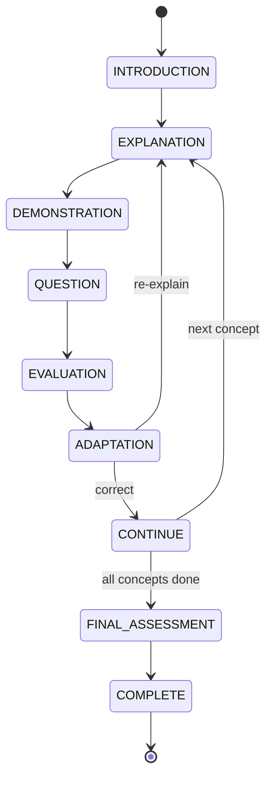
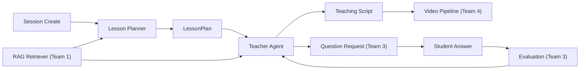

# Team 2 — AI Teacher / Lesson Agent Engineer

## 1. Role / Mission

Build the **brain** of the AI Teacher — the orchestration agent that plans lessons, delivers explanations, and drives the core teaching loop. You are responsible for transforming a topic or document into a structured, adaptive teaching experience. The Teacher Agent is NOT a chatbot; it follows a pedagogical state machine that teaches one concept at a time, checks understanding, and adapts.

## 2. Scope

### What you OWN

- Lesson plan generation (topic/document → structured `LessonPlan`)
- Personalization logic (adapting content to level, language, goal, time, depth, style)
- Teacher Agent state machine (the teaching loop)
- Concept sequencing and prerequisite ordering
- Teaching script generation (what the teacher "says" per segment)
- Time allocation across concepts
- RAG context integration (grounding explanations in retrieved content)
- Language handling (generate lessons in target language, preserve context on language change)
- Decision rules (what to do after evaluation results)
- Learning path generation for broad topics
- Prompt design for lesson planning and teaching

### What you do NOT own

- Document upload/extraction/retrieval — Team 1
- Question generation, answer evaluation, misconception detection — Team 3
- Voice, avatar, video generation — Team 4
- Frontend UI — Team 5
- API routes, database persistence, session management — Team 6

### Dependencies

| Dependency | Provider | What you need |
|---|---|---|
| Retrieval API | Team 1 | `Retriever.search(query, doc_id, top_k)` returns `RetrievalChunk[]` |
| Evaluation results | Team 3 | `StudentEvaluation` with `correct`, `misconception`, `next_action` |
| Question generation | Team 3 | `QuestionGenerator.generate(concept, level, language)` |
| Video generation | Team 4 | Consumes your teaching scripts |
| API routes | Team 6 | Exposes your agent through `/api/sessions/*` |
| LLM API key | Team 6 | `settings.LLM_API_KEY` and `settings.LLM_MODEL` |

## 3. Mandatory Tasklist (P0)

### Learner Understanding

- [ ] Accept and validate learner parameters from session creation:
  - `learner_level` (beginner / intermediate / advanced)
  - `language` (ISO code: en, hi, etc.)
  - `goal` (free text, e.g., "understand neural networks")
  - `duration_minutes` (5, 10, 20, 60)
  - `existing_knowledge` (optional list of known concepts)
  - `teaching_style` (conceptual / practical / example-heavy)
  - `desired_depth` (overview / standard / deep)
- [ ] Build a `LearnerContext` object that is passed to all LLM calls

### Lesson Planning

- [ ] Convert topic into a list of key concepts
- [ ] If document mode: use retrieved content (from Team 1) to identify concepts from the material
- [ ] Identify prerequisite ordering (teach A before B if B depends on A)
- [ ] Allocate time to each concept based on complexity and total `duration_minutes`
- [ ] Decide checkpoint positions (where to ask questions)
- [ ] Decide example types per concept
- [ ] Decide visual type per concept (equation, diagram, graph, code, timeline, none)
- [ ] Produce a structured `LessonPlan` matching the schema in `packages/types/lesson.ts`
- [ ] Validate LLM output against `LessonPlan` schema before returning

### Teacher Agent State Machine

Implement the following states:

- [ ] **INTRODUCTION** — Greet, explain what will be taught, set expectations
- [ ] **EXPLANATION** — Teach the current concept with an explanation script
- [ ] **DEMONSTRATION** — Provide a concrete example, worked problem, or visual description
- [ ] **QUESTION** — Trigger question generation (delegate to Team 3)
- [ ] **EVALUATION** — Receive evaluation result from Team 3, update state
- [ ] **ADAPTATION** — Based on evaluation, decide: continue / re-explain / simplify / use analogy
- [ ] **CONTINUE** — Move to the next concept
- [ ] **FINAL_ASSESSMENT** — Trigger final quiz (delegate to Team 3)
- [ ] **COMPLETE** — Session finished, signal report generation

### Teaching Script Generation

- [ ] For each segment, generate a natural teaching script (what the avatar "says")
- [ ] Script must be in the selected `language`
- [ ] Script must match the `learner_level` (beginner = simple analogies; advanced = technical depth)
- [ ] Script must reference source material when in document mode (cite page/chapter)
- [ ] Keep scripts concise: ~30-60 seconds of speech per segment

### Personalization

#### Beginner

- [ ] Use simple, everyday language
- [ ] Include real-world analogies
- [ ] Focus on fundamentals only
- [ ] Avoid jargon or define it immediately

#### Intermediate

- [ ] Use technical terms with brief definitions
- [ ] Include practical, applied examples
- [ ] Connect concepts to real use cases

#### Advanced

- [ ] Use full technical depth
- [ ] Include mathematical formulations, proofs, or implementation details where relevant
- [ ] Reference advanced techniques and edge cases

### Time Adaptation

- [ ] **5-minute mode** — 1-2 key concepts, high-level overview
- [ ] **20-minute mode** — 3-5 concepts, balanced explanation + examples + questions
- [ ] **60-minute mode** — Deep coverage, multiple checkpoints, comprehensive examples
- [ ] **Multi-day plan** — Split into sessions, track across sessions

### Language Support

- [ ] Generate lesson content entirely in the selected language
- [ ] Support at minimum: English (`en`), Hindi (`hi`), Hinglish (`hi-en`)
- [ ] Preserve lesson state when the language changes mid-session
- [ ] Update teaching scripts to the new language without restarting the lesson

### RAG Integration

- [ ] Before generating each concept's explanation, query Team 1's retriever
- [ ] Include retrieved chunks in the LLM prompt as grounding context
- [ ] Instruct the LLM: "Base your explanation on the following source material"
- [ ] Preserve source references (page, chapter) in the teaching script
- [ ] If no document is provided, teach from the LLM's general knowledge

### Decision Rules (Post-Evaluation)

- [ ] Correct answer → continue to next concept (or increase difficulty)
- [ ] Incorrect answer → re-explain with a different approach (analogy, worked example, visual)
- [ ] 2 incorrect on the same concept → simplify language and reteach
- [ ] 3 failures on the same concept → mark as weak, move on with note to revisit
- [ ] Time running low → prioritize remaining high-value concepts, skip detailed examples
- [ ] Language changed → rebuild scripts in new language, preserve progress

## 4. P1 Important Tasks

- [ ] Teacher personality modes (friendly, formal, encouraging, Socratic)
- [ ] Follow-up conversation (student asks clarifying questions mid-lesson)
- [ ] Exam preparation mode (focus on likely exam topics)
- [ ] Revision mode (targeted review of weak concepts from past sessions)
- [ ] Learning path generation for broad topics (e.g., "Machine Learning" → ordered subtopics across sessions)
- [ ] Context window management (summarize earlier segments to stay within token limits)

## 5. P2 Optional Tasks

- [ ] Multi-turn Socratic dialogue (guide student to discover answers)
- [ ] Collaborative teaching (reference what the student already knows from their profile)
- [ ] Dynamic time reallocation based on mid-lesson performance
- [ ] Teacher "thinking out loud" narration for complex problem-solving

## 6. Technical Architecture





## 7. Detailed Implementation Flow

### Lesson Generation Flow

```
Session created with { topic, document_id, language, level, duration, goal }
  → If document_id: retrieve top concepts from document outline + chunks
  → If topic only: use LLM to decompose topic into concepts
  → Order concepts by prerequisites
  → Allocate time proportionally (complex concepts get more time)
  → Place checkpoints (after every 1-2 concepts)
  → Generate LessonPlan JSON
  → Validate against schema
  → Return LessonPlan
```

### Teaching Flow (per segment)

```
Enter EXPLANATION state for current concept
  → If document mode: retrieve relevant chunks
  → Build prompt: { concept, level, language, context_chunks, examples }
  → Call LLM → get teaching script
  → Validate script is in correct language
  → Attach visual_type for Team 4
  → Send segment to Team 4 for video generation
  → Enter QUESTION state
  → Request question from Team 3
  → Wait for student answer
  → Receive StudentEvaluation from Team 3
  → Apply decision rules
  → Update lesson state
  → Proceed to next state
```

## 8. Technology Recommendations

| Technology | Role | Why | Replaceable? |
|---|---|---|---|
| **Gemini 2.5 Flash** | Primary LLM | Fast, cheap, strong multilingual support, large context window | Yes → GPT-4o, Claude 3.5 Sonnet |
| **Pydantic** | Output validation | Already in project, validates LLM JSON output against schemas | No |
| **LangChain** (optional) | LLM orchestration | Structured output, prompt templates, chains | Yes → direct API calls with `httpx` |
| **JSON mode** | LLM output | Force LLM to return valid JSON for `LessonPlan` | Use LLM's native JSON mode |

> **MVP recommendation**: Use direct LLM API calls via `httpx` with JSON mode. Avoid LangChain complexity unless the team is already familiar with it. Gemini 2.5 Flash is the best balance of cost/speed/quality for a hackathon.

## 9. Interfaces / API Contracts

### Input: Session Creation (from Team 6)

```json
{
  "topic": "Ohm's Law",
  "document_id": null,
  "language": "hi",
  "learner_level": "beginner",
  "duration_minutes": 20,
  "goal": "Understand basic electrical circuits"
}
```

### Output: LessonPlan

```json
{
  "title": "ओम का नियम — बिजली के सर्किट को समझें",
  "duration_minutes": 20,
  "language": "hi",
  "learner_level": "beginner",
  "segments": [
    {
      "id": "seg_1",
      "concept": "voltage",
      "minutes": 4,
      "explanation": "वोल्टेज एक ऐसी ताकत है जो बिजली को तार में आगे बढ़ाती है। इसे पानी के पाइप में दबाव की तरह सोचें...",
      "example": "एक बैटरी 9V का वोल्टेज देती है — यह पानी के नल की तरह है जो पानी को धकेलता है।",
      "visual_type": "diagram",
      "checkpoint": false
    },
    {
      "id": "seg_2",
      "concept": "current",
      "minutes": 4,
      "explanation": "करंट यानी बिजली का बहाव...",
      "example": "...",
      "visual_type": "diagram",
      "checkpoint": true
    },
    {
      "id": "seg_3",
      "concept": "resistance",
      "minutes": 5,
      "explanation": "प्रतिरोध (resistance) वो चीज़ है जो करंट को रोकती है...",
      "example": "...",
      "visual_type": "equation",
      "checkpoint": true
    },
    {
      "id": "seg_4",
      "concept": "ohms_law",
      "minutes": 5,
      "explanation": "ओम का नियम: V = I × R...",
      "example": "...",
      "visual_type": "equation",
      "checkpoint": true
    }
  ]
}
```

### Agent State (internal, stored per session)

```json
{
  "current_segment_index": 2,
  "current_concept": "resistance",
  "current_state": "QUESTION",
  "completed_concepts": ["voltage", "current"],
  "weak_concepts": [],
  "time_remaining_minutes": 11,
  "attempt_count": { "resistance": 1 },
  "language": "hi",
  "learner_level": "beginner",
  "last_evaluation": null,
  "adaptation_history": []
}
```

### Teaching Script Output (consumed by Team 4)

```json
{
  "segment_id": "seg_3",
  "concept": "resistance",
  "script": "अब हम प्रतिरोध के बारे में जानेंगे। प्रतिरोध वो चीज़ है जो बिजली के बहाव को रोकती है। इसे ऐसे समझो — अगर पानी का पाइप पतला हो, तो पानी कम बहेगा। वैसे ही पतला तार ज़्यादा प्रतिरोध करता है।",
  "visual_type": "equation",
  "visual_description": "Show V = IR formula with labeled arrows: V (voltage), I (current), R (resistance)",
  "duration_seconds": 45,
  "language": "hi",
  "source_references": [
    { "page": 12, "chapter": "Chapter 4" }
  ]
}
```

### Adaptation Request (after receiving evaluation from Team 3)

```json
{
  "evaluation": {
    "question_id": "q1",
    "correct": false,
    "score": 0.2,
    "concept": "resistance",
    "misconception": "Student thinks resistance increases current",
    "confidence": 0.91,
    "next_action": "analogy_then_retest",
    "difficulty": "easy"
  },
  "decision": "re_explain",
  "new_approach": "analogy",
  "new_script": "चलो इसे दूसरी तरह से समझते हैं। सोचो कि एक सड़क है और उस पर बहुत ट्रैफिक है..."
}
```

## 10. Data Structures

### LearnerContext (built from session + profile)

```python
class LearnerContext:
    level: str              # beginner | intermediate | advanced
    language: str           # en | hi | hi-en
    goal: str | None
    teaching_style: str     # conceptual | practical | example-heavy
    desired_depth: str      # overview | standard | deep
    duration_minutes: int
    existing_knowledge: list[str]
    weak_concepts: list[str]
    strong_concepts: list[str]
```

### TeacherState (persisted per session in `lesson_state` column)

```python
class TeacherState:
    current_segment_index: int
    current_state: str       # INTRODUCTION | EXPLANATION | DEMONSTRATION | QUESTION | EVALUATION | ADAPTATION | CONTINUE | FINAL_ASSESSMENT | COMPLETE
    completed_concepts: list[str]
    weak_concepts: list[str]
    time_remaining_minutes: int
    attempt_count: dict[str, int]    # concept → attempts
    adaptation_history: list[dict]   # past adaptations for context
    language: str
```

## 11. Prompt / AI Design

### Prompt 1: Lesson Planning

**File**: `packages/prompts/teacher/lesson_planning.md`

**Responsibility**: Convert topic + learner context into a structured LessonPlan.

**Input variables**: `{topic}`, `{level}`, `{language}`, `{duration}`, `{goal}`, `{context_chunks}` (if document mode)

**Output**: Valid JSON matching `LessonPlan` schema

**Validation**:
- Must have at least 1 segment
- `duration_minutes` across segments must sum to ≤ total duration
- `language` must match requested language
- `visual_type` must be one of: equation, diagram, graph, timeline, code, none

**Failure handling**: If LLM returns invalid JSON → retry once → if still invalid → return error

### Prompt 2: Teaching Script

**File**: `packages/prompts/teacher/teaching_script.md` (to create)

**Responsibility**: Generate the teacher's spoken explanation for one concept.

**Input variables**: `{concept}`, `{level}`, `{language}`, `{example}`, `{visual_type}`, `{context_chunks}`, `{duration_seconds}`

**Output**: Natural language script, 30-60 seconds of speech

**Grounding rule**: When `context_chunks` are provided, include phrase like "According to [chapter/page]..."

### Prompt 3: Adaptation

**File**: `packages/prompts/teacher/adaptation.md` (to create)

**Responsibility**: Re-explain a concept after the student answered incorrectly.

**Input variables**: `{concept}`, `{misconception}`, `{previous_explanation}`, `{approach}` (analogy/simplify/worked_example), `{language}`

**Output**: New explanation script using the requested approach

**Rule**: Must NOT repeat the same explanation. Must address the specific misconception.

### Anti-Patterns

- ❌ Do NOT use a single monolithic prompt for the entire teaching loop
- ❌ Do NOT include evaluation logic in the teacher prompt — that's Team 3
- ❌ Do NOT hardcode examples in prompts — generate them dynamically
- ✅ DO use separate focused prompts for planning, scripting, and adaptation

## 12. Error Handling

| Failure | Response |
|---|---|
| LLM returns invalid JSON for LessonPlan | Retry once with stricter prompt → if still invalid, return error |
| LLM returns wrong language | Detect language mismatch, retry with explicit language instruction |
| LLM hallucinates content not in document | Check: if document mode and no matching chunk, flag and re-prompt with grounding instructions |
| RAG retrieval returns 0 chunks | Fall back to general knowledge with disclaimer: "This explanation is not from your uploaded document" |
| Session state corrupted | Log error, attempt to recover from last valid state |
| Duration exceeded | Gracefully skip to FINAL_ASSESSMENT |
| LLM API timeout | Retry once → return error to frontend with "please try again" |
| Unknown `next_action` from evaluation | Default to `re_explain` |

## 13. Testing Checklist

### Unit Tests

- [ ] `planner.py`: Given a topic + level + duration → returns valid `LessonPlan` JSON
- [ ] `planner.py`: Segments sum to ≤ total duration
- [ ] `planner.py`: Concepts are ordered by prerequisites
- [ ] `personalization.py`: Beginner level generates simple language
- [ ] `personalization.py`: Advanced level generates technical content
- [ ] `lesson_state.py`: State transitions follow the state machine correctly
- [ ] `lesson_state.py`: Decision rules map evaluation results to correct actions
- [ ] `teacher_agent.py`: Script is generated in the requested language

### Integration Tests

- [ ] Full flow: topic → lesson plan → first segment script → question trigger
- [ ] Document mode: document_id → retrieve chunks → lesson plan references source material
- [ ] Language change mid-session: state preserved, scripts switch language
- [ ] Adaptation flow: incorrect answer → re-explanation generated with different approach

### Edge Cases

- [ ] Very short duration (5 min) → only 1-2 concepts, no deep examples
- [ ] Very long duration (60 min) → multiple checkpoints, detailed examples
- [ ] Nonsensical topic → LLM returns best-effort plan (do not crash)
- [ ] Empty RAG results → falls back to general knowledge
- [ ] 3 consecutive failures on same concept → marks weak and moves on

### End-to-End Test

- [ ] Create session with "Ohm's Law" + beginner + Hindi + 20 min → generate plan → teach first concept → ask question → student answers wrong → agent adapts → student answers correctly → proceed

## 14. Demo Requirements

During the hackathon demo, the Teacher Agent must demonstrate:

1. **Lesson plan generation** — Show the structured plan with concepts, time allocation, and visual types
2. **Teaching in Hindi** — The AI teacher explains in Hindi at a beginner level
3. **Adaptive response** — When the student gives a WRONG answer:
   - The agent detects the misconception (via Team 3)
   - The agent generates a NEW explanation using a different approach
   - The agent asks a NEW question
   - The student answers correctly
4. **Document grounding** (if document uploaded) — The explanation references specific pages/chapters from the uploaded material
5. **Time awareness** — The lesson fits within the selected duration

> **Critical**: The adaptation moment is the MOST IMPORTANT demo feature. The judges must see the AI "change its mind" and teach differently.

## 15. Definition of Done

- [ ] Lesson planner generates valid `LessonPlan` for any topic
- [ ] LessonPlan respects learner level, language, and duration constraints
- [ ] Teacher Agent follows the state machine correctly through all states
- [ ] Teaching scripts are generated in the correct language
- [ ] Document mode: explanations are grounded in retrieved content
- [ ] Decision rules correctly handle correct, incorrect, and repeated failures
- [ ] Adaptation generates genuinely different explanations (not repeats)
- [ ] Language can be changed mid-session without losing progress
- [ ] All prompts are stored in `packages/prompts/teacher/`
- [ ] Unit tests pass for planner, state machine, and personalization
- [ ] Integration test passes for the full teaching loop

## 16. Handoff to Other Teams

| Artifact | Consumer | What they need |
|---|---|---|
| `LessonPlanner.generate(topic, context, learner)` | Team 6 | Called from `POST /api/sessions/{id}/start` |
| `TeacherAgent.get_next_action(session, evaluation)` | Team 6 | Called after answer evaluation to determine next step |
| `TeacherAgent.generate_script(segment, context)` | Team 4 | Returns teaching script + visual_type for video generation |
| `LessonPlan` schema | Team 5 | Displayed in the lesson plan screen |
| `TeacherState` | Team 6 | Persisted in session `lesson_state` column |
| Prompts in `packages/prompts/teacher/` | All teams | Shared prompt templates |

### Information Team 3 needs from you

- Which concept is currently being taught
- What learner level and language to use for questions
- The teaching script (so questions are contextually relevant)

### Information Team 4 needs from you

- Teaching script text
- Visual type and description
- Target language
- Approximate duration per segment

## 17. Performance / Cost Considerations

| Concern | Mitigation |
|---|---|
| LLM cost for lesson planning | One LLM call per lesson plan. Gemini 2.5 Flash: ~$0.001 per plan. |
| LLM cost for teaching scripts | One call per segment. ~4 segments per lesson ≈ $0.004. |
| LLM latency | Gemini 2.5 Flash: ~1-3 seconds per call. Lesson planning: ~3-5 seconds total. |
| Token limits | Lesson plans are ~500-1000 tokens output. Well within limits. |
| Context window with RAG | Include top 3-5 chunks (~2000 tokens). Stay within 8K input. |
| Adaptation calls | One extra LLM call per adaptation. Acceptable. |

## 18. Security / Privacy

- Never include the raw LLM API key in prompts or logs
- Do not log full teaching scripts (may contain document content)
- Sanitize topic input (reject extremely long or suspicious inputs)
- Do not expose internal prompt templates to the frontend
- Student answers processed by the Teacher Agent should not be persisted in logs

## 19. Known Limitations

- **Concept decomposition** depends on LLM quality — some topics may get poorly structured plans
- **Prerequisite detection** is heuristic (LLM-based) — may occasionally order concepts wrong
- **Language quality** varies by LLM — Hindi may be less natural than English
- **Adaptation quality** depends on misconception accuracy from Team 3
- **No real-time streaming** — teaching scripts are generated per-segment, not word-by-word
- **Context window** — very long documents may require summarization to fit in prompts
- **Multi-session continuity** — MVP does not carry detailed state across separate sessions

## 20. Suggested Implementation Order

| Phase | Tasks | Est. Time |
|---|---|---|
| **Phase 1 — Planner** | Lesson plan generation from topic + level + language + duration | 4-5 hours |
| **Phase 2 — State Machine** | TeacherState + state transitions + decision rules | 3-4 hours |
| **Phase 3 — Scripts** | Teaching script generation + personalization + language support | 3-4 hours |
| **Phase 4 — RAG Integration** | Ground explanations in retrieved chunks (coordinate with Team 1) | 2-3 hours |
| **Phase 5 — Adaptation** | Re-explanation with different approaches after wrong answers | 2-3 hours |
| **Phase 6 — Integration** | Wire up with Team 6 APIs + Team 3 evaluation + Team 4 scripts | 2-3 hours |
| **Phase 7 — Testing** | Unit tests + integration test + demo rehearsal | 2 hours |

---

## Files to Create / Modify

```
backend/app/services/teacher/
├── __init__.py              ← export public classes/functions
├── planner.py               ← LessonPlan generation (LLM call)
├── teacher_agent.py         ← core state machine + decision logic
├── lesson_state.py          ← TeacherState management
├── personalization.py       ← level/style/depth adaptation
├── topic_planner.py         ← broad topic → learning path

packages/prompts/teacher/
├── lesson_planning.md       ← lesson planning system prompt
├── teaching_script.md       ← NEW: script generation prompt
├── adaptation.md            ← NEW: re-explanation prompt

backend/tests/
├── test_planner.py
├── test_teacher_agent.py
├── test_lesson_state.py
```

---

## Instructions for AI Coding Assistants

1. Read the root `README.md` before modifying any code.
2. Read shared contracts in `packages/types/lesson.ts` and `packages/types/evaluation.ts` — your output must match these schemas.
3. Read existing code in `backend/app/services/teacher/` before creating new files.
4. All Teacher Agent code goes in `backend/app/services/teacher/`. Do not place files elsewhere.
5. Do not modify another team's service directory (`rag/`, `assessment/`, `video/`, `learner/`).
6. Use `backend/app/core/config.py` → `settings` for LLM configuration. Never hardcode API keys.
7. Store all prompts in `packages/prompts/teacher/`. Do not embed prompts as string literals in Python code.
8. Validate LLM structured output against Pydantic schemas before returning. Never trust raw LLM JSON.
9. Follow existing naming conventions: snake_case for files/functions, PascalCase for classes.
10. Handle LLM API failures with try/except, retry once, then return a meaningful error.
11. Do not silently change the `LessonPlan` or `LessonSegment` schema — coordinate with Team 5 and Team 6.
12. Log state transitions at INFO level for debugging.
13. Keep prompts modular — separate prompts for planning, scripting, and adaptation. No monolithic prompts.
14. Add tests in `backend/tests/` for every new function.
15. Before finishing, provide:
    - Files changed
    - Functionality implemented
    - Tests run and their results
    - Remaining issues
    - Integration requirements for Team 3, Team 4, and Team 6
