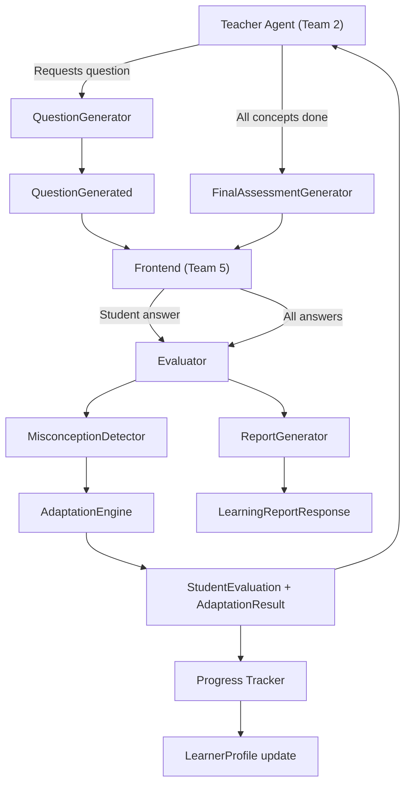

# Team 3 — Interactive Assessment & Adaptive Learning Engineer

## 1. Role / Mission

Make the AI Teacher **respond intelligently** to student performance. You build the question generator, answer evaluator, misconception detector, adaptation engine, and final assessment/report system. Your work is what turns a passive lecture into an **interactive, adaptive** teaching experience — and it is the single most important differentiator for the hackathon judges.

## 2. Scope

### What you OWN

- Question generation (concept-aware, level-aware, language-aware)
- Answer evaluation (correct / partially correct / incorrect / off-topic)
- Misconception detection (identify WHY the student is wrong)
- Adaptive response recommendation (what the teacher should do next)
- Final assessment quiz generation
- Score calculation and learning report generation
- Per-concept mastery tracking (attempts, correct count, misconceptions)
- Adaptation rules engine

### What you do NOT own

- Teaching scripts or explanations — Team 2
- How the adaptation is delivered (voice, avatar, video) — Team 4
- Frontend question/answer UI — Team 5
- Persisting evaluations/progress to database — Team 6
- Document retrieval — Team 1

### Dependencies

| Dependency | Provider | What you need |
|---|---|---|
| Current concept + level + language | Team 2 | From `TeacherState` via session |
| Teaching script context | Team 2 | What was just taught (to generate contextual questions) |
| Learner profile | Team 6 | `LearnerProfile` for personalization history |
| Progress persistence | Team 6 | Stores evaluations, progress, and reports in DB |
| API routes | Team 6 | Exposes your evaluator through `/api/sessions/{id}/answer` |

## 3. Mandatory Tasklist (P0)

### Question Generation

- [ ] Generate MCQ questions (4 options, 1 correct, plausible distractors)
- [ ] Generate short-answer questions
- [ ] Generate conceptual questions ("Explain why...")
- [ ] Generate numerical/problem-solving questions
- [ ] Generate "explain in your own words" questions
- [ ] Match question difficulty to student level (easy / medium / hard)
- [ ] Match question language to lesson language
- [ ] Tie every question to a specific `concept`
- [ ] For MCQs, make distractors based on common misconceptions (not random)
- [ ] Return questions matching the `QuestionGenerated` schema
- [ ] Validate LLM output before returning

### Answer Evaluation

- [ ] Evaluate student answers as: correct / partially_correct / incorrect / off_topic
- [ ] Calculate a score (0.0 to 1.0) for partial credit
- [ ] Generate a brief, constructive feedback message (not just "correct" / "wrong")
- [ ] Assess confidence level of the evaluation (0.0 to 1.0)
- [ ] For MCQs: simple match + explain why
- [ ] For short answers: semantic similarity + concept coverage check
- [ ] For explanations: check key concept presence and misconceptions
- [ ] Return evaluation matching the `StudentEvaluation` schema

### Misconception Detection

- [ ] When the answer is incorrect, identify the likely misconception
- [ ] Describe the misconception in plain language (e.g., "Student thinks resistance increases current")
- [ ] Identify which concept is affected
- [ ] Never just say "wrong" — always explain the nature of the error
- [ ] Use the student's actual answer to infer the misunderstanding (not generic errors)

### Adaptive Response Recommendation

- [ ] Based on evaluation results, recommend a `next_action`:
  - `continue` — student understood, move forward
  - `increase_difficulty` — student is excelling
  - `keep_difficulty` — student is at the right level
  - `simplify` — use simpler language, break into smaller parts
  - `use_analogy` — explain with a real-world analogy
  - `worked_example` — show step-by-step solution
  - `show_visual` — use a diagram or visual explanation
  - `re_explain` — explain the same concept differently
  - `re_test` — ask another question on the same concept
  - `mark_weak` — flag this concept as weak, move on
- [ ] Apply the MVP adaptation rules (see section below)
- [ ] Return adaptation matching the `AdaptationResult` schema

### Final Assessment

- [ ] Generate a final quiz covering all taught concepts (3-5 questions)
- [ ] Mix question types (MCQ + short answer + conceptual)
- [ ] Weight questions toward concepts the student struggled with
- [ ] Evaluate all answers
- [ ] Calculate overall score

### Learning Report

- [ ] Generate a `LearningReportResponse` including:
  - Total questions and correct answers
  - Overall score (0-100%)
  - Strong concepts (mastery ≥ 80%)
  - Weak concepts (mastery < 50%)
  - Misconceptions encountered
  - Revision recommendations
  - Next topic recommendation
- [ ] Match the `LearningReportResponse` schema in `packages/types/learner.ts`

### Per-Concept Progress Tracking

- [ ] Track per concept: attempts, correct_count, misconceptions list
- [ ] Calculate mastery: `correct_count / attempts`
- [ ] Mark concept status: `not_started` / `in_progress` / `mastered` / `weak`
- [ ] Provide progress data matching `ProgressResponse` schema

## 4. P1 Important Tasks

- [ ] Spaced revision recommendations (revisit weak concepts after N days)
- [ ] Personalized homework/practice questions
- [ ] Flashcard generation from lesson content
- [ ] Exam simulation mode (timed, formal assessment)
- [ ] Difficulty calibration from historical performance across sessions
- [ ] Bloom's taxonomy question classification

## 5. P2 Optional Tasks

- [ ] Peer comparison analytics (anonymized)
- [ ] Gamification elements (streaks, achievements)
- [ ] Question bank persistence and reuse
- [ ] Adaptive question ordering within final assessment

## 6. Technical Architecture



## 7. Detailed Implementation Flow

### Question Generation Flow

```
Teacher Agent requests question for concept X
  → Build prompt: { concept, level, language, lesson_context, question_type }
  → Call LLM with question generation prompt
  → Parse and validate JSON output against QuestionGenerated schema
  → Return question to frontend (via Team 6 API)
```

### Evaluation Flow

```
Student submits answer { question_id, answer, concept }
  → Load the original question (from session state or cache)
  → Build evaluation prompt: { question, correct_answer, student_answer, concept }
  → Call LLM → get { correct, score, feedback, misconception }
  → Validate output against StudentEvaluation schema
  → Run adaptation rules engine
  → Update per-concept progress tracking
  → Return AnswerResponse: { evaluation, feedback, next_question?, adaptation? }
```

### Adaptation Rules Engine (MVP)

```
if score >= 0.8:
    if consecutive_correct >= 2:
        next_action = "increase_difficulty"
    else:
        next_action = "continue"

elif score >= 0.5:
    next_action = "re_test"  # partial understanding, try again

else:  # incorrect
    attempts_on_concept = get_attempts(concept)
    
    if attempts_on_concept == 1:
        next_action = "re_explain"  # first failure
    elif attempts_on_concept == 2:
        next_action = "use_analogy"  # second failure, try analogy
    elif attempts_on_concept >= 3:
        next_action = "mark_weak"  # give up, note for revision
```

### Final Assessment Flow

```
All lesson concepts completed
  → Collect all concept names + student's weak areas
  → Generate 3-5 mixed questions weighted toward weak concepts
  → Present to student
  → Evaluate all answers
  → Calculate score: (correct / total) * 100
  → Categorize concepts as strong/weak
  → Generate revision recommendations
  → Suggest next topic
  → Return LearningReportResponse
```

## 8. Technology Recommendations

| Technology | Role | Why | Replaceable? |
|---|---|---|---|
| **Gemini 2.5 Flash** | Question generation + evaluation | Fast, cheap, good at structured output | Yes → GPT-4o, Claude |
| **Pydantic** | Output validation | Validate LLM output against schemas | No |
| **JSON mode** | LLM output format | Force structured JSON for reliable parsing | Required |
| **difflib** (stdlib) | Text similarity | Simple similarity check for short answers as fallback | Yes → sentence-transformers |

> **MVP recommendation**: Use the same LLM as Team 2. Question generation and evaluation are separate LLM calls with focused prompts. Do NOT combine them into one giant prompt.

## 9. Interfaces / API Contracts

### Question Generation Input

```json
{
  "concept": "resistance",
  "learner_level": "beginner",
  "language": "hi",
  "question_type": "mcq",
  "lesson_context": "We just taught that resistance opposes current flow in a circuit, measured in ohms."
}
```

### Question Generation Output

```json
{
  "id": "q_seg3_1",
  "question_text": "अगर किसी तार का प्रतिरोध बढ़ जाए, तो करंट पर क्या असर होगा?",
  "question_type": "mcq",
  "concept": "resistance",
  "difficulty": "easy",
  "options": [
    "करंट बढ़ेगा",
    "करंट कम होगा",
    "करंट वही रहेगा",
    "वोल्टेज बढ़ेगा"
  ],
  "correct_answer": "करंट कम होगा",
  "language": "hi"
}
```

### Answer Submission (from Frontend via Team 6)

```json
{
  "question_id": "q_seg3_1",
  "answer": "करंट बढ़ेगा",
  "concept": "resistance"
}
```

### Answer Response (full evaluation result)

```json
{
  "evaluation": {
    "question_id": "q_seg3_1",
    "correct": false,
    "score": 0.0,
    "concept": "resistance",
    "misconception": "Student believes increasing resistance increases current — this is the inverse of Ohm's Law. The student may be confusing resistance with voltage.",
    "confidence": 0.94,
    "next_action": "use_analogy",
    "difficulty": "easy"
  },
  "feedback": "यह सही नहीं है। जब प्रतिरोध बढ़ता है, तो करंट कम होता है, ज़्यादा नहीं। चलो इसे एक उदाहरण से समझते हैं...",
  "next_question": null,
  "adaptation": {
    "action": "use_analogy",
    "difficulty": "easy",
    "reason": "Second attempt on 'resistance' failed. Using analogy approach."
  }
}
```

### Learning Report Response

```json
{
  "session_id": "sess_abc123",
  "total_questions": 6,
  "correct_answers": 4,
  "score": 66.7,
  "strong_concepts": ["voltage", "current"],
  "weak_concepts": ["resistance"],
  "misconceptions": [
    "Believes increasing resistance increases current"
  ],
  "revision_recommendations": [
    "Review the relationship between resistance and current using water pipe analogy",
    "Practice numerical problems with V=IR"
  ],
  "next_topic": "Series and Parallel Circuits"
}
```

## 10. Data Structures

### ConceptProgress (tracked per concept per session)

```python
class ConceptProgress:
    concept: str
    attempts: int            # total questions asked
    correct_count: int       # correct answers
    mastery: float           # correct_count / attempts
    misconceptions: list[str]
    status: str              # not_started | in_progress | mastered | weak
    difficulty_level: str    # current difficulty: easy | medium | hard
```

### SessionAssessmentState (internal tracking)

```python
class SessionAssessmentState:
    questions_asked: list[QuestionGenerated]
    evaluations: list[StudentEvaluation]
    concept_progress: dict[str, ConceptProgress]
    consecutive_correct: int
    consecutive_incorrect: int
    total_adaptations: int
```

### Adaptation Rules Config

```python
ADAPTATION_RULES = {
    "correct_threshold": 0.8,       # score >= 0.8 = correct
    "partial_threshold": 0.5,       # score >= 0.5 = partial
    "increase_after_streak": 2,     # increase difficulty after N correct
    "simplify_after_failures": 2,   # simplify after N failures
    "mark_weak_after": 3,           # give up after N total failures
}
```

## 11. Prompt / AI Design

### Prompt 1: Question Generation

**File**: `packages/prompts/assessment/question_generation.md`

**Input variables**: `{concept}`, `{level}`, `{language}`, `{question_type}`, `{lesson_context}`

**Output**: JSON matching `QuestionGenerated` schema

**Rules**:
- MCQ distractors must be based on real misconceptions, not random
- Questions must test understanding, not memorization
- Language must match the lesson language exactly
- Difficulty must match the student's current level

**Validation**:
- MCQ must have exactly 4 options
- `correct_answer` must be one of the options (for MCQ)
- `concept` must not be empty
- `question_text` must be in the correct language

### Prompt 2: Answer Evaluation

**File**: `packages/prompts/assessment/answer_evaluation.md` (to create)

**Input variables**: `{question}`, `{correct_answer}`, `{student_answer}`, `{concept}`, `{question_type}`

**Output**: JSON matching `StudentEvaluation` schema

**Rules**:
- For MCQs: direct match is sufficient
- For short answers: check semantic equivalence, allow minor phrasing differences
- For explanations: check for key concepts mentioned, identify gaps
- Always explain WHY the answer is correct/incorrect
- If incorrect, identify the specific misconception

**Validation**:
- `score` must be between 0.0 and 1.0
- `correct` must be boolean
- `misconception` must be non-null when `correct` is false
- `next_action` must be a valid action string

### Prompt 3: Final Assessment Questions

**File**: `packages/prompts/assessment/final_assessment.md` (to create)

**Input variables**: `{concepts}`, `{weak_concepts}`, `{level}`, `{language}`, `{num_questions}`

**Output**: JSON array of `QuestionGenerated` objects

**Rules**:
- Weight questions toward weak concepts (2x likelihood)
- Mix question types
- Cover all taught concepts if possible
- Keep difficulty appropriate to demonstrated level

### Anti-Patterns

- ❌ Do NOT evaluate answers with string matching alone — use LLM for semantic evaluation
- ❌ Do NOT make misconceptions generic ("student doesn't understand") — be specific
- ❌ Do NOT combine question generation and evaluation in one prompt
- ✅ DO validate all LLM output against Pydantic schemas

## 12. Error Handling

| Failure | Response |
|---|---|
| LLM returns invalid question JSON | Retry once → if still invalid, generate a simple fallback MCQ |
| LLM returns invalid evaluation JSON | Retry once → if still invalid, return `{ correct: false, score: 0, next_action: "re_explain" }` |
| MCQ has wrong number of options | Fix: trim to 4 or regenerate |
| `correct_answer` not in MCQ options | Regenerate question |
| Misconception detection fails | Return generic: "Student's understanding of {concept} needs review" |
| Empty student answer submitted | Return: `{ correct: false, score: 0, feedback: "No answer provided", next_action: "re_test" }` |
| LLM API timeout during evaluation | Retry once → return error asking student to resubmit |
| Final assessment generation fails | Fall back to re-asking checkpoint questions from the lesson |
| Report generation fails | Return partial report with available data |

## 13. Testing Checklist

### Unit Tests

- [ ] `question_generator.py`: MCQ has exactly 4 options and a valid correct answer
- [ ] `question_generator.py`: Short answer question has a correct answer
- [ ] `question_generator.py`: Question language matches requested language
- [ ] `question_generator.py`: Question difficulty matches requested level
- [ ] `evaluator.py`: Correct MCQ answer → `correct: true`, `score: 1.0`
- [ ] `evaluator.py`: Incorrect MCQ answer → `correct: false`, `misconception` is non-null
- [ ] `evaluator.py`: Partially correct short answer → `score` between 0.3-0.7
- [ ] `misconception.py`: Incorrect answer produces a specific misconception (not generic)
- [ ] `adaptation.py`: 2 correct in a row → `increase_difficulty`
- [ ] `adaptation.py`: 1 incorrect → `re_explain`
- [ ] `adaptation.py`: 2 incorrect same concept → `use_analogy`
- [ ] `adaptation.py`: 3 incorrect same concept → `mark_weak`
- [ ] `report.py`: Report includes all required fields
- [ ] `report.py`: Score calculation is correct: `(correct / total) * 100`

### Integration Tests

- [ ] Generate question → evaluate correct answer → returns `continue`
- [ ] Generate question → evaluate wrong answer → returns misconception + adaptation
- [ ] Full assessment: 5 questions → evaluate all → generate report
- [ ] Hindi question generated → Hindi answer evaluated correctly

### Edge Cases

- [ ] Student submits empty answer
- [ ] Student submits answer in wrong language
- [ ] Very long student answer (1000+ chars)
- [ ] MCQ answer that is not one of the options
- [ ] All answers correct → report shows 100% score
- [ ] All answers incorrect → report shows all weak concepts

### End-to-End Test

- [ ] Full misconception loop: question → wrong answer → misconception detected → adaptation returned → new question → correct answer → continue

## 14. Demo Requirements

The assessment and adaptation system is the **star of the demo**. The judges MUST see:

1. **AI asks a question** relevant to what was just taught
2. **Student gives a WRONG answer**
3. **System detects the specific misconception** (shown on screen or narrated)
4. **Teacher changes approach** — uses an analogy, visual, or simplified explanation
5. **AI asks a NEW question** (different from the first)
6. **Student answers CORRECTLY**
7. **Final assessment** with a score and learning report
8. **Report shows** strengths, weaknesses, misconceptions, and next-topic recommendation

> **Critical**: This loop (wrong → detect → adapt → correct) is what wins the hackathon. Practice it. Hard-code the "wrong" answer in the demo script if needed to guarantee the flow works.

## 15. Definition of Done

- [ ] Question generator produces valid questions for all 5 types (MCQ, short, conceptual, numerical, explain)
- [ ] Evaluator correctly identifies correct, incorrect, and partially correct answers
- [ ] Misconception detector provides specific, non-generic misconceptions
- [ ] Adaptation engine returns appropriate `next_action` based on rules
- [ ] Final assessment generates mixed questions weighted toward weak concepts
- [ ] Learning report includes all required fields (score, strengths, weaknesses, misconceptions, recommendations, next topic)
- [ ] All outputs match schemas in `packages/types/evaluation.ts` and `packages/types/learner.ts`
- [ ] Questions and evaluations work in Hindi and English
- [ ] Unit tests pass for all components
- [ ] The misconception → adaptation → correct answer demo flow works end-to-end

## 16. Handoff to Other Teams

| Artifact | Consumer | What they need |
|---|---|---|
| `QuestionGenerator.generate(concept, level, lang, type)` | Team 2 (via Team 6) | Called when Teacher Agent enters QUESTION state |
| `Evaluator.evaluate(question, answer)` | Team 6 | Called from `POST /api/sessions/{id}/answer` |
| `AdaptationEngine.recommend(evaluation, progress)` | Team 2 | Returns `AdaptationResult` for Teacher Agent |
| `ReportGenerator.generate(session_id, evaluations, progress)` | Team 6 | Called from `GET /api/sessions/{id}/report` |
| `StudentEvaluation` schema | Team 2, Team 5 | Consumed for adaptation and display |
| `AnswerResponse` schema | Team 5 | Displayed as feedback in Teaching Room |
| `LearningReportResponse` schema | Team 5 | Displayed in Learning Report screen |

### What Team 2 needs from you

- `StudentEvaluation` after every answer
- `AdaptationResult` with recommended `next_action`
- `LearningReportResponse` at session end

### What Team 5 needs from you (via Team 6)

- Question text, options (for MCQ), and type
- Feedback message after evaluation
- Score and learning report

## 17. Performance / Cost Considerations

| Concern | Mitigation |
|---|---|
| Question generation LLM cost | ~$0.001 per question (Gemini 2.5 Flash). ~5-8 questions per session ≈ $0.008. |
| Evaluation LLM cost | ~$0.001 per evaluation. Same number as questions. |
| Evaluation latency | Must be < 3 seconds for responsive UX. Use Gemini Flash, not heavy models. |
| Final assessment | One batch call for 3-5 questions. ~$0.003. |
| Report generation | Simple aggregation, no LLM needed (except next-topic recommendation). |

## 18. Security / Privacy

- Do not log student answers in production (privacy)
- Evaluation results tied to user session — do not expose across users
- Sanitize student answer input (reject > 5000 chars, strip HTML)
- Misconception data is sensitive — store only with session, not globally

## 19. Known Limitations

- **Semantic evaluation** of free-text answers is approximate — LLM may misjudge
- **Misconception detection** is LLM-based and may occasionally produce incorrect diagnoses
- **MCQ distractor quality** depends on LLM's knowledge of common misconceptions in the domain
- **Numerical question evaluation** is challenging — LLM may not correctly verify calculations
- **Language quality** for non-English evaluations depends on LLM proficiency
- **No question deduplication** in MVP — same question may be regenerated
- **Adaptation rules are simple** — no ML-based difficulty calibration in MVP

## 20. Suggested Implementation Order

| Phase | Tasks | Est. Time |
|---|---|---|
| **Phase 1 — Question Generator** | MCQ + short answer generation with LLM | 3-4 hours |
| **Phase 2 — Evaluator** | Answer evaluation + scoring + feedback | 3-4 hours |
| **Phase 3 — Misconception** | Misconception detection from wrong answers | 2-3 hours |
| **Phase 4 — Adaptation** | Adaptation rules engine + `next_action` recommendation | 2-3 hours |
| **Phase 5 — Final Assessment** | Final quiz + report generation | 2-3 hours |
| **Phase 6 — Integration** | Wire up with Team 2 + Team 6 APIs | 2-3 hours |
| **Phase 7 — Testing** | Unit tests + the critical demo loop | 2 hours |

---

## Files to Create / Modify

```
backend/app/services/assessment/
├── __init__.py              ← export public classes
├── question_generator.py    ← question generation (LLM call)
├── evaluator.py             ← answer evaluation (LLM call)
├── misconception.py         ← misconception detection
├── adaptation.py            ← adaptation rules engine
├── report.py                ← learning report generation

packages/prompts/assessment/
├── question_generation.md   ← question generation prompt
├── answer_evaluation.md     ← NEW: evaluation prompt
├── final_assessment.md      ← NEW: final quiz prompt

backend/tests/
├── test_question_generator.py
├── test_evaluator.py
├── test_adaptation.py
├── test_report.py
```

---

## Instructions for AI Coding Assistants

1. Read the root `README.md` before modifying any code.
2. Read shared contracts in `packages/types/evaluation.ts` and `packages/types/learner.ts` — all outputs must match these schemas.
3. Read existing schemas in `backend/app/schemas/evaluation.py` before creating new ones.
4. All assessment code goes in `backend/app/services/assessment/`. Do not place files elsewhere.
5. Do not modify another team's service directory (`rag/`, `teacher/`, `video/`, `learner/`).
6. Use `backend/app/core/config.py` → `settings` for LLM configuration. Never hardcode API keys.
7. Store all prompts in `packages/prompts/assessment/`. Do not embed prompts as string literals in Python code.
8. Validate ALL LLM structured output against Pydantic schemas before returning. Never trust raw LLM JSON.
9. Follow existing naming conventions: snake_case for files/functions, PascalCase for classes.
10. Handle LLM API failures with try/except, retry once, then return a safe fallback evaluation.
11. Do not silently change the `StudentEvaluation`, `AnswerResponse`, or `QuestionGenerated` schemas — coordinate with Team 2 and Team 6.
12. The adaptation rules engine should be a simple Python function (not an LLM call). Keep it deterministic and testable.
13. MCQ `correct_answer` MUST be one of the `options`. Validate this before returning.
14. Add tests in `backend/tests/` for every new function.
15. Before finishing, provide:
    - Files changed
    - Functionality implemented
    - Tests run and their results
    - Remaining issues
    - Integration requirements for Team 2 and Team 6
