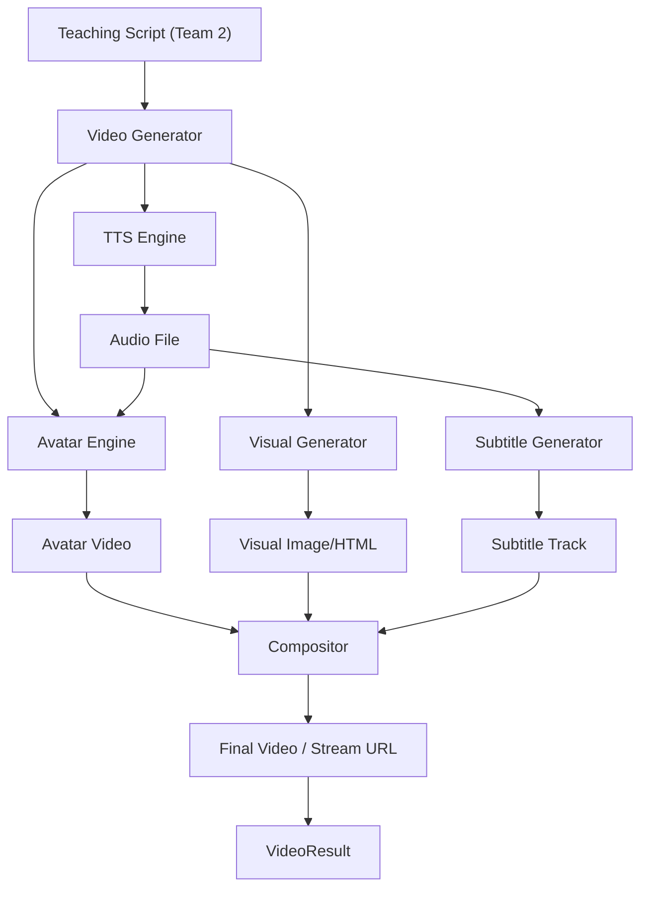
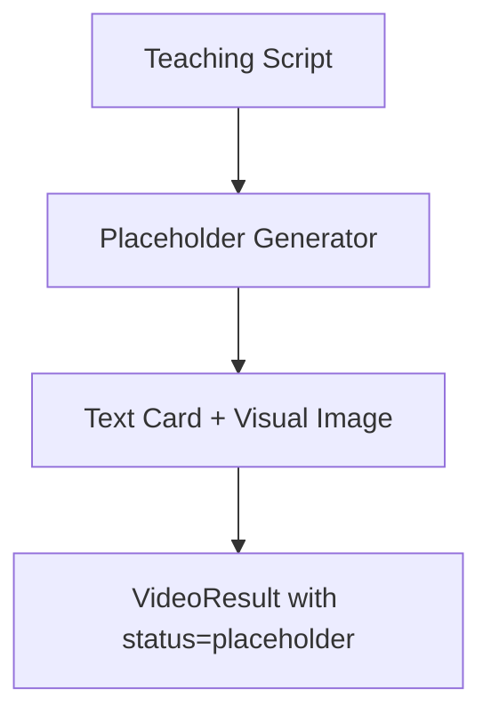

# Team 4 — AI Teacher Video, Voice & Visual Engineer

## 1. Role / Mission

Turn lesson segments into a **convincing multimodal teaching experience** using an AI avatar, natural voice, and subject-aware educational visuals. You are the presentation layer — the "face and voice" of the AI Teacher. Without your work, the system is just text on a screen. The judges expect to SEE a teacher teaching, not just read generated text.

## 2. Scope

### What you OWN

- Text-to-Speech (TTS) integration
- AI avatar / talking-head video generation
- Subject-aware visual generation/selection (diagrams, equations, graphs, code, timelines)
- Audio-visual synchronization
- Subtitle/transcript generation
- Video composition pipeline (avatar + visuals + subtitles → playable output)
- Speech-to-Text (STT) for voice-based student answers (P1)
- Multilingual voice support

### What you do NOT own

- Teaching script content — Team 2
- What questions to ask — Team 3
- Frontend video player UI — Team 5
- API routes for video endpoints — Team 6
- Document content — Team 1

### Dependencies

| Dependency | Provider | What you need |
|---|---|---|
| Teaching scripts | Team 2 | `script`, `visual_type`, `visual_description`, `language`, `duration_seconds` per segment |
| API routes | Team 6 | `POST /api/video/generate`, `GET /api/video/{segment_id}/status` |
| API keys | Team 6 | `settings.TTS_API_KEY`, `settings.AVATAR_API_KEY` |
| File storage | Team 6 | Where to store generated audio/video files |

## 3. Mandatory Tasklist (P0)

### Text-to-Speech (TTS)

- [ ] Integrate a TTS provider (ElevenLabs, Edge-TTS, or Google TTS)
- [ ] Select a natural, teacher-appropriate voice
- [ ] Support English voice generation
- [ ] Support Hindi voice generation
- [ ] Control speaking speed (slightly slower for beginners)
- [ ] Generate audio file (MP3/WAV) from teaching script text
- [ ] Return audio duration in seconds
- [ ] Handle TTS API failures gracefully

### AI Avatar

- [ ] Integrate an avatar/talking-head provider (HeyGen, D-ID, or Synthesia)
- [ ] Select a professional teacher avatar
- [ ] Pass teaching script (or audio) to avatar API
- [ ] Generate talking-head video where the avatar speaks the lesson
- [ ] Handle generation status polling (pending → generating → completed → failed)
- [ ] Handle avatar API failures with meaningful error messages
- [ ] Support async generation (video may take 30-60 seconds)

### Subject-Aware Visuals

Generate or select educational visuals based on `visual_type`:

- [ ] **equation** — Render mathematical equations/formulas (LaTeX → image, or formatted text overlay)
- [ ] **diagram** — Generate or select relevant diagrams (circuit, anatomy, architecture)
- [ ] **graph** — Generate data visualizations, charts, plots
- [ ] **timeline** — Create chronological event sequences
- [ ] **code** — Render syntax-highlighted code snippets with optional output
- [ ] **none** — No visual, avatar only

Visual requirements:
- [ ] Visuals must be educational, not decorative
- [ ] Visuals must label important parts
- [ ] Visuals must be readable (clear fonts, high contrast)
- [ ] Generate a `visual_description` from Team 2's segment data

### Synchronization

- [ ] Match visual display duration to speech duration
- [ ] Show equations/diagrams while the teacher is speaking about them
- [ ] Include subtitles synchronized with audio
- [ ] Keep the avatar visible alongside visuals (split-screen or overlay)

### Video Composition Pipeline

- [ ] Orchestrate: Script → TTS → Avatar → Visual → Compose
- [ ] Generate a playable video file or stream URL
- [ ] Return `VideoResult` matching schema in `packages/types/video.ts`
- [ ] Track generation status per segment
- [ ] Support a **placeholder mode**: if avatar/TTS APIs are unavailable, return the script text + visual as a fallback (so the demo can proceed)

### Subtitles

- [ ] Generate subtitles/captions from the teaching script
- [ ] Include subtitles in the video output (burned-in or as a separate track)
- [ ] Support Hindi and English subtitles

## 4. P1 Important Tasks

- [ ] **Speech-to-Text (STT)**: Accept voice input from students (browser microphone → text) via `stt.py`
- [ ] Dynamic animations (animated diagrams, step-by-step equation building)
- [ ] Multiple teacher avatar options / personalities
- [ ] Real-time voice conversation mode (streaming TTS + STT)
- [ ] Background music / ambient sounds for engagement

## 5. P2 Optional Tasks

- [ ] Emotion-aware avatar (happy when student answers correctly, encouraging when wrong)
- [ ] Advanced subject simulations (interactive physics simulations, 3D models)
- [ ] Live avatar streaming (instead of pre-generated videos)
- [ ] Custom avatar creation from user photo

## 6. Technical Architecture



### Placeholder Mode (Fallback)



## 7. Detailed Implementation Flow

### Full Pipeline (with Avatar API)

```
Segment received: { segment_id, script, visual_type, language, duration }
  → Set status: "generating"
  → Step 1: Generate TTS audio from script
      → Call TTS API (ElevenLabs/Edge-TTS) with language + voice
      → Receive audio file + duration
  → Step 2: Generate visual
      → Based on visual_type, call visual generator
      → For equations: render LaTeX or use formatted text
      → For diagrams: use LLM to describe → generate with image API or use placeholder
      → For code: syntax-highlight and render as image
  → Step 3: Generate avatar video
      → Pass audio or script to avatar API (HeyGen/D-ID)
      → Poll for completion (may take 30-60 seconds)
      → Receive video URL
  → Step 4: Compose (if needed)
      → Overlay visual alongside avatar (split-screen layout)
      → Add subtitles
  → Set status: "completed"
  → Return VideoResult: { segment_id, status, video_url, duration_seconds, language }
```

### Placeholder Pipeline (no Avatar API / fallback)

```
Segment received: { segment_id, script, visual_type, language }
  → Generate visual image
  → Generate subtitle text
  → Create a simple slide: visual + subtitle overlay + TTS audio
  → Set status: "placeholder"
  → Return VideoResult with placeholder flag
```

> **Critical for hackathon**: Build the placeholder pipeline FIRST. It ensures the demo works even if avatar APIs are slow, expensive, or unavailable. Then layer on the full avatar pipeline.

## 8. Technology Recommendations

| Technology | Role | Why | Replaceable? |
|---|---|---|---|
| **Edge-TTS** | Text-to-Speech (free) | Free, supports Hindi + English, natural voices, no API key | Yes → ElevenLabs (better quality, costs money) |
| **ElevenLabs** | Text-to-Speech (premium) | Best quality, multilingual, voice cloning | Yes → Edge-TTS (free fallback) |
| **D-ID** | AI avatar/talking head | API-based, accepts audio → generates talking video | Yes → HeyGen, Synthesia |
| **HeyGen** | AI avatar (alternative) | Better quality avatars, more customizable | Yes → D-ID |
| **Matplotlib** | Graph/chart generation | Simple, in Python, creates clean plots | Yes → Plotly |
| **Pillow** | Image composition | Already in `requirements.txt`, basic image manipulation | No |
| **LaTeX/MathJax** | Equation rendering | Standard for math notation | Or use LLM to describe equations as formatted text |
| **Pygments** | Code syntax highlighting | Python library for code highlighting | Yes → highlight.js (if frontend rendering) |

> **MVP recommendation**:
> - **TTS**: Start with **Edge-TTS** (free, no API key needed, `pip install edge-tts`). Switch to ElevenLabs for demo polish.
> - **Avatar**: Use **D-ID** or **HeyGen** free trial. Build placeholder mode first.
> - **Visuals**: Use **Matplotlib** for graphs, **Pillow** for text overlays, **Pygments** for code.

## 9. Interfaces / API Contracts

### Video Generate Request (from Team 6 API)

```json
{
  "session_id": "sess_abc123",
  "segment_id": "seg_3",
  "script": "प्रतिरोध वो चीज़ है जो बिजली के बहाव को रोकती है। इसे ऐसे समझो — अगर पानी का पाइप पतला हो, तो पानी कम बहेगा...",
  "visual_type": "equation",
  "visual_description": "Show V = IR formula with labeled arrows",
  "language": "hi",
  "duration_seconds": 45
}
```

### Video Result Response

```json
{
  "segment_id": "seg_3",
  "status": "completed",
  "video_url": "/api/video/files/seg_3_output.mp4",
  "duration_seconds": 47,
  "language": "hi"
}
```

### Video Status Response (polling)

```json
{
  "segment_id": "seg_3",
  "status": "generating",
  "video_url": null,
  "duration_seconds": null
}
```

### Status values

```
"pending"     → Request received, not started
"generating"  → TTS/Avatar/Visual being created
"completed"   → Video ready to play
"failed"      → Generation failed (see error)
"placeholder" → Fallback mode (no avatar, text + visual only)
```

### TTS Internal Function

```python
async def generate_speech(
    text: str,
    language: str,       # "en" | "hi"
    voice_id: str = None,
    speed: float = 1.0
) -> TTSResult:
    """Returns audio file path and duration."""
```

```python
class TTSResult:
    audio_path: str
    duration_seconds: float
    language: str
```

### Visual Internal Function

```python
async def generate_visual(
    visual_type: str,        # equation | diagram | graph | timeline | code | none
    description: str,        # what to show
    concept: str,
    language: str
) -> VisualResult:
    """Returns visual image path."""
```

```python
class VisualResult:
    image_path: str | None
    visual_type: str
    width: int
    height: int
```

## 10. Data Structures

### VideoGenerationJob (internal tracking)

```python
class VideoGenerationJob:
    segment_id: str
    session_id: str
    status: str                # pending | generating | completed | failed | placeholder
    script: str
    language: str
    visual_type: str
    audio_path: str | None
    visual_path: str | None
    avatar_video_url: str | None
    final_video_url: str | None
    duration_seconds: float | None
    error_message: str | None
    created_at: datetime
    completed_at: datetime | None
```

### Supported Voices (configuration)

```python
VOICES = {
    "en": {
        "edge_tts": "en-US-AriaNeural",       # natural female
        "elevenlabs": "voice_id_english"
    },
    "hi": {
        "edge_tts": "hi-IN-SwaraNeural",       # natural Hindi female
        "elevenlabs": "voice_id_hindi"
    }
}
```

## 11. Prompt / AI Design

### Visual Description Prompt (for diagram/complex visual generation)

**File**: `packages/prompts/visual/visual_selection.md`

**When used**: When `visual_type` is `diagram` and the description needs to be converted to a specific visual.

```
Given the concept "{concept}" being taught at the "{level}" level,
describe a clear educational diagram that would help explain this concept.

Description request: "{visual_description}"

Return JSON:
{
  "title": "Diagram title",
  "elements": ["element 1", "element 2"],
  "layout": "top-to-bottom | left-to-right | circular",
  "labels": ["label 1", "label 2"],
  "connections": [{"from": "A", "to": "B", "label": "relationship"}]
}
```

### Visual Generation Strategy (no LLM needed for most cases)

| visual_type | Generation method |
|---|---|
| equation | Render LaTeX or formatted text using Pillow |
| graph | Generate with Matplotlib (if data available) or render description text |
| diagram | Use LLM to describe → render text/arrows with Pillow; or use placeholder image |
| timeline | Render with Pillow (list of events with dates) |
| code | Syntax-highlight with Pygments → render as image |
| none | No visual generated |

## 12. Error Handling

| Failure | Response |
|---|---|
| TTS API timeout | Retry once → fall back to Edge-TTS (free) → if all fail, return script text only |
| TTS unsupported language | Fall back to English voice with a warning |
| Avatar API timeout | Return video with placeholder status (text + visual, no avatar) |
| Avatar API rate limit | Queue and retry; return placeholder in the meantime |
| Avatar API credit exhausted | Switch to placeholder mode permanently for session |
| Visual generation failure | Return video without visual (avatar + subtitles only) |
| LaTeX rendering error | Fall back to plain text representation of the equation |
| Invalid script (empty text) | Return error: "Empty teaching script provided" |
| Video file too large | Compress or reduce resolution |
| Storage full | Return error, do not crash |
| Unsupported language for TTS | Return error with list of supported languages |

## 13. Testing Checklist

### Unit Tests

- [ ] `tts.py`: English text → generates audio file with duration > 0
- [ ] `tts.py`: Hindi text → generates audio file (not English voice)
- [ ] `tts.py`: Empty text → returns error
- [ ] `visuals.py`: `visual_type="equation"` → generates readable image
- [ ] `visuals.py`: `visual_type="code"` → generates syntax-highlighted image
- [ ] `visuals.py`: `visual_type="none"` → returns None
- [ ] `avatar.py`: Script → returns generation job ID and status
- [ ] `video_generator.py`: Full pipeline → returns `VideoResult`
- [ ] `video_generator.py`: Placeholder mode works without avatar API

### Integration Tests

- [ ] TTS + Avatar: script → audio → avatar video → video URL
- [ ] TTS + Visual: script → audio → visual image → composed output
- [ ] Placeholder pipeline: script → text card + visual → placeholder result
- [ ] Hindi script → Hindi audio → Hindi subtitles

### Edge Cases

- [ ] Very long script (500+ words) → TTS handles without truncation
- [ ] Very short script (1 sentence) → generates valid output
- [ ] Special characters in script (equations, symbols) → TTS handles gracefully
- [ ] Avatar API returns 500 → falls back to placeholder
- [ ] Concurrent video generation requests → handled without conflicts

### End-to-End Test

- [ ] Generate one complete teaching video segment: avatar speaks the lesson in Hindi with an equation visual and subtitles

## 14. Demo Requirements

During the hackathon demo, the video/voice pipeline must deliver:

1. **AI avatar speaking** — A visible avatar that appears to be teaching (talking head)
2. **Natural voice** — Not robotic; uses a natural-sounding TTS voice
3. **Hindi voice** — The avatar teaches in Hindi (matching the demo scenario)
4. **Educational visual** — While the avatar explains, a relevant visual (equation, diagram) is shown on screen
5. **Subtitles** — Captions displayed during the teaching

> **Minimum viable demo**: If avatar APIs are unavailable or too slow, the **placeholder mode** must work: show the teaching text with visual and TTS audio. This MUST be built first.

> **Ideal demo**: Avatar video + voice + educational visual + subtitles, all synchronized.

## 15. Definition of Done

- [ ] TTS generates natural audio for English and Hindi scripts
- [ ] Avatar API integration works and generates talking-head video
- [ ] Placeholder pipeline works as a fallback (no avatar dependency)
- [ ] At least 3 visual types work: equation, code, and one of (diagram/graph/timeline)
- [ ] Subtitles are generated from the teaching script
- [ ] `VideoResult` response matches schema in `packages/types/video.ts`
- [ ] Video generation status tracking works (pending → generating → completed/failed/placeholder)
- [ ] Error handling returns meaningful messages for all failure cases
- [ ] One complete demo segment works end-to-end: Hindi script → avatar + voice + visual + subtitles

## 16. Handoff to Other Teams

| Artifact | Consumer | What they need |
|---|---|---|
| `VideoGenerator.generate(request)` | Team 6 | Called from `POST /api/video/generate` |
| `VideoGenerator.get_status(segment_id)` | Team 6 | Called from `GET /api/video/{segment_id}/status` |
| `VideoResult` response | Team 5 | Video URL, status, duration for playback in Teaching Room |
| Audio files | Team 5 (indirect) | Served via static files or API endpoint |
| `STTService.transcribe(audio)` (P1) | Team 6 | Voice input → text for answer submission |

### What Team 2 needs to give you

- Teaching script text per segment
- `visual_type` and `visual_description`
- Target language
- Approximate duration

### What Team 5 needs from you (via Team 6)

- Video URL (playable in `<video>` element or iframe)
- Status updates (for loading/generating states)
- Duration for progress bar
- Subtitle text or file

## 17. Performance / Cost Considerations

| Concern | Mitigation |
|---|---|
| **TTS cost** | Edge-TTS is FREE. ElevenLabs: ~$0.30/1K characters. A 45-second segment ≈ 150 words ≈ 800 chars ≈ $0.24. Budget ~$5 for hackathon. |
| **Avatar cost** | D-ID: ~$0.10-0.20 per video. HeyGen: similar. Budget ~$10-20 for hackathon demo. |
| **Avatar latency** | 30-90 seconds per segment. Pre-generate videos for demo. Do not generate on-the-fly during judging. |
| **Video storage** | ~5-10 MB per segment. ~50 MB per session. Acceptable for hackathon. |
| **Concurrent generation** | Avatar APIs may throttle. Generate segments sequentially or with low concurrency. |
| **Free tier limits** | D-ID free: ~5 minutes of video. HeyGen free: limited. Plan accordingly. |

> **Hackathon tip**: Pre-generate your demo videos before the presentation. Do not rely on live generation during judging — API latency will kill the demo.

## 18. Security / Privacy

- TTS and avatar API keys stored in `.env`, never committed to git
- Generated video files stored in `data/processed/` — not publicly accessible without auth
- Student voice recordings (P1 STT) should be deleted after transcription
- Do not send student personal data to third-party TTS/avatar APIs
- Audio files may contain teaching content from uploaded documents — handle with same privacy as documents

## 19. Known Limitations

- **Avatar latency**: 30-90 seconds per video segment — not suitable for real-time interactive teaching in MVP
- **Avatar quality**: Free-tier avatars may look generic or uncanny
- **Language support**: Not all TTS voices sound natural in every language
- **Visual quality**: Auto-generated diagrams may be simplistic compared to hand-drawn educational visuals
- **No lip sync guarantee**: Some avatar APIs sync lips to audio poorly
- **No streaming**: Videos are pre-generated, not streamed in real-time
- **Video composition**: Full split-screen composition (avatar + visual) may require FFmpeg, adding complexity
- **Free tier limits**: Demo must be planned carefully around API credit limits

## 20. Suggested Implementation Order

| Phase | Tasks | Est. Time |
|---|---|---|
| **Phase 1 — TTS** | Edge-TTS integration (free, no key needed) for English + Hindi | 2-3 hours |
| **Phase 2 — Placeholder Pipeline** | Script → TTS audio + text card + subtitle → playable result | 3-4 hours |
| **Phase 3 — Visuals** | Equation rendering + code highlighting + basic diagram | 3-4 hours |
| **Phase 4 — Avatar** | D-ID or HeyGen integration + status polling | 3-4 hours |
| **Phase 5 — Composition** | Combine avatar + visual + subtitles (or just serve alongside) | 2-3 hours |
| **Phase 6 — Integration** | Wire up with Team 6 API routes + test with Team 2 scripts | 2-3 hours |
| **Phase 7 — Demo Prep** | Pre-generate demo videos, test playback in frontend | 2 hours |

> **Start with Phase 1+2 (TTS + Placeholder)**. This ensures the demo works even without avatar APIs. Everything else is layered on top.

---

## Files to Create / Modify

```
backend/app/services/video/
├── __init__.py              ← export public classes
├── tts.py                   ← TTS integration (Edge-TTS / ElevenLabs)
├── avatar.py                ← Avatar API integration (D-ID / HeyGen)
├── visuals.py               ← Visual generation (equations, diagrams, code)
├── video_generator.py       ← orchestration pipeline
├── stt.py                   ← Speech-to-Text (P1)

packages/prompts/visual/
├── visual_selection.md      ← visual description prompt

backend/tests/
├── test_tts.py
├── test_visuals.py
├── test_video_generator.py
```

---

## Instructions for AI Coding Assistants

1. Read the root `README.md` before modifying any code.
2. Read shared contracts in `packages/types/video.ts` — your output must match `VideoResult`.
3. Read existing schemas in `backend/app/schemas/video.py` before creating new ones.
4. All video/voice code goes in `backend/app/services/video/`. Do not place files elsewhere.
5. Do not modify another team's service directory (`rag/`, `teacher/`, `assessment/`, `learner/`).
6. Use `backend/app/core/config.py` → `settings` for all API keys. Never hardcode them.
7. **Build placeholder mode FIRST**. Ensure the system works without avatar/TTS APIs before integrating them.
8. Handle all external API calls (TTS, avatar) with try/except and meaningful fallbacks.
9. Generated files (audio, video, images) go in `data/processed/{session_id}/`.
10. Follow existing naming conventions: snake_case for files/functions, PascalCase for classes.
11. Do not silently change the `VideoResult` or `VideoGenerateRequest` schemas — coordinate with Team 5 and Team 6.
12. Log generation status changes at INFO level.
13. Add tests in `backend/tests/` for every new function.
14. Use async functions for all API calls (TTS, avatar) — they are I/O-bound.
15. Before finishing, provide:
    - Files changed
    - Functionality implemented
    - Tests run and their results
    - Remaining issues (especially API key requirements)
    - Integration requirements for Team 6
