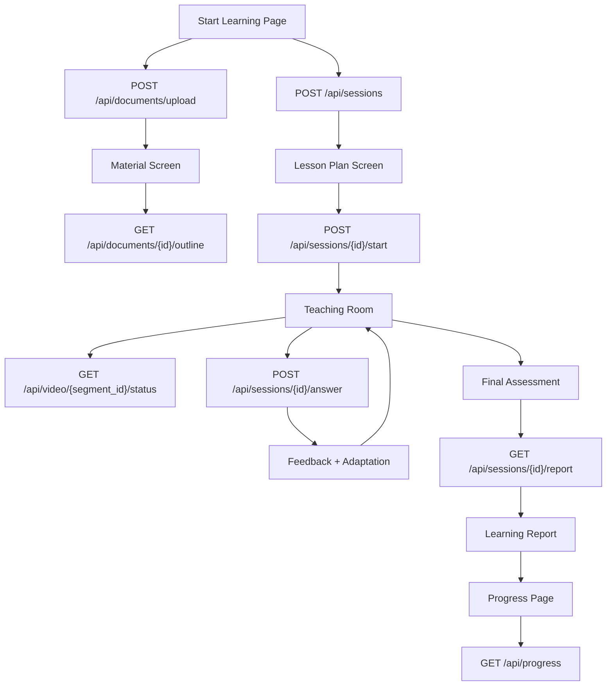

# Team 5 — Frontend / Student Experience Engineer

## 1. Role / Mission

Build the **complete student-facing interface** for the AI Teacher. You are responsible for the entire user experience — from uploading a document and configuring a lesson, to watching the AI teach, answering questions, and reviewing the learning report. The UI must be intuitive enough that a hackathon judge understands the product within 30 seconds.

## 2. Scope

### What you OWN

- All pages and UI components in `apps/web/`
- Start Learning page (topic input, file upload, learner parameters)
- Material Screen (document outline, processing status)
- Lesson Plan Screen (concepts, time allocation, sequence)
- Teaching Room (avatar/video player, visuals, subtitles, questions, answer input, feedback)
- Assessment Screen (final quiz questions, answer submission)
- Learning Report Screen (score, strengths, weaknesses, misconceptions, next topic)
- Progress / History page (past sessions, scores, learning path)
- Responsive design and UI states (loading, error, empty)
- API integration with backend endpoints

### What you do NOT own

- Backend API logic — Team 6
- AI/ML services (RAG, Teacher, Assessment, Video) — Teams 1-4
- Database models or schemas — Team 6
- Authentication backend logic — Team 6

### Dependencies

| Dependency | Provider | What you need |
|---|---|---|
| All API endpoints | Team 6 | REST endpoints under `/api/*` |
| `LessonPlan` schema | Team 2 (via `packages/types/lesson.ts`) | Structure for lesson plan display |
| `VideoResult` schema | Team 4 (via `packages/types/video.ts`) | Video URL + status for playback |
| `StudentEvaluation` schema | Team 3 (via `packages/types/evaluation.ts`) | Feedback, misconception, adaptation display |
| `LearningReportResponse` schema | Team 3 (via `packages/types/learner.ts`) | Report data for display |
| Backend running | Team 6 | `http://localhost:8000` during development |

## 3. Mandatory Tasklist (P0)

### Start Learning Page (`/learn`)

- [ ] Topic text input (free text, e.g., "Ohm's Law")
- [ ] File upload with drag-and-drop (PDF, DOCX, PPTX only)
- [ ] File type validation on the client side (reject unsupported types)
- [ ] Upload progress indicator
- [ ] Learner level selector (Beginner / Intermediate / Advanced)
- [ ] Language selector (English, Hindi, Hinglish)
- [ ] Goal text input (optional, e.g., "Understand basic circuits")
- [ ] Duration selector (5 min / 10 min / 20 min / 60 min)
- [ ] Teaching style selector (Conceptual / Practical / Example-heavy)
- [ ] "Start Learning" button → calls `POST /api/sessions`
- [ ] Validate: either topic or file must be provided

### Material Screen (if document uploaded)

- [ ] Show uploaded filename and file type
- [ ] Show document processing status (uploading → extracting → indexing → ready)
- [ ] Display document outline (chapters/sections) once processed
- [ ] Allow optional chapter/section selection to scope the lesson
- [ ] Handle processing errors (show retry option)

### Lesson Plan Screen

- [ ] Display lesson title
- [ ] Display list of concepts with time allocation
- [ ] Display estimated total duration
- [ ] Display language and difficulty level
- [ ] Show which concepts have checkpoints (questions)
- [ ] "Start Lesson" button → calls `POST /api/sessions/{id}/start`

### Teaching Room (`/lesson/[id]`) — MOST CRITICAL SCREEN

Must display simultaneously:

- [ ] **AI avatar / video player** — plays the teaching video segment (or placeholder)
- [ ] **Video controls** — play, pause, volume, speed
- [ ] **Current concept indicator** — which concept is being taught
- [ ] **Educational visual** — equation, diagram, graph, code alongside the avatar
- [ ] **Subtitles / captions** — displayed below or over the video
- [ ] **Time / progress bar** — lesson progress (segment X of Y)
- [ ] **Question panel** — when a checkpoint is reached:
  - Display the question text
  - For MCQ: show 4 clickable option buttons
  - For short answer: show text input
  - For explain: show textarea
  - Submit answer button → calls `POST /api/sessions/{id}/answer`
- [ ] **Teacher feedback panel** — after answer submission:
  - Show correct/incorrect indicator
  - Show feedback message
  - Show misconception explanation (if incorrect)
  - Show adaptation message ("Let me explain this differently...")
- [ ] **Adaptation indicator** — visually show that the teacher is adapting (e.g., "🔄 Changing approach..." animation)

### Assessment Screen

- [ ] Display final assessment questions (3-5 questions)
- [ ] Accept answers for each question
- [ ] Submit all answers → calls assessment endpoint
- [ ] Show per-question feedback after submission
- [ ] Show overall score

### Learning Report Screen (`/assessment/[id]` or `/progress/[id]`)

- [ ] Overall score (percentage with visual indicator — gauge, bar, or circle)
- [ ] Strong concepts (green list)
- [ ] Weak concepts (red list)
- [ ] Misconceptions encountered (with explanations)
- [ ] Revision recommendations
- [ ] Next topic recommendation with "Start Next Topic" button
- [ ] Option to download/share report

### Progress / History Page (`/progress`)

- [ ] List of past learning sessions
- [ ] Per-session: topic, date, score, duration
- [ ] Overall statistics (topics studied, average score)
- [ ] Strong and weak concepts across all sessions
- [ ] Current learning path

### UI States (across all pages)

- [ ] **Loading** — skeleton loaders or spinners during API calls
- [ ] **Processing** — document being processed, lesson being generated
- [ ] **Video generating** — show progress indicator while video is being created
- [ ] **Video ready** — auto-play or play button
- [ ] **API failure** — show error message with retry option
- [ ] **Empty state** — no sessions yet, no documents uploaded
- [ ] **Invalid upload** — wrong file type, file too large

## 4. P1 Important Tasks

- [ ] Dark mode toggle
- [ ] Accessibility: keyboard navigation, screen reader support, high contrast
- [ ] Teacher personality selector (friendly, formal, Socratic)
- [ ] Study planner / revision calendar
- [ ] Flashcard review mode
- [ ] Responsive mobile layout
- [ ] PWA support (installable web app)

## 5. P2 Optional Tasks

- [ ] Voice input for answers (microphone button → STT via Team 4)
- [ ] Animated transitions between teaching states
- [ ] Multi-language UI (not just content — the UI labels themselves)
- [ ] Session sharing / export
- [ ] Gamification (streaks, badges)

## 6. Technical Architecture



### Page Structure

```
apps/web/app/
├── page.tsx              ← Landing / Home
├── layout.tsx            ← Root layout (nav, fonts, global styles)
├── globals.css           ← Global styles
├── learn/
│   └── page.tsx          ← Start Learning page
├── lesson/
│   └── [id]/
│       └── page.tsx      ← Teaching Room
├── assessment/
│   └── [id]/
│       └── page.tsx      ← Assessment + Report
├── progress/
│   └── page.tsx          ← Progress / History
└── lib/
    ├── api.ts            ← API client functions
    └── types.ts          ← re-export from packages/types
```

## 7. Detailed Implementation Flow

### User Journey (Happy Path)

```
1. User opens app → sees Start Learning page
2. User enters "Ohm's Law", selects Beginner, Hindi, 20 min
3. Clicks "Start Learning" → POST /api/sessions
4. Redirect to Lesson Plan screen
5. Shows: 4 concepts, 20 minutes, Hindi, Beginner
6. Clicks "Start Lesson" → POST /api/sessions/{id}/start
7. Redirect to Teaching Room
8. Video generates → polls GET /api/video/{seg}/status
9. Video plays: avatar teaches in Hindi with visual
10. Checkpoint: question appears in panel
11. User answers incorrectly
12. Feedback panel shows: ❌ misconception explanation + "Let me try differently"
13. New explanation plays (adaptation)
14. New question appears
15. User answers correctly ✅
16. Continues through remaining concepts
17. Final Assessment: 3-5 questions displayed
18. User submits answers
19. Learning Report: score, strengths, weaknesses, next topic
20. User clicks "Start Next Topic" → back to step 2
```

### Teaching Room State Machine (Frontend)

```
LOADING → PLAYING → QUESTION → EVALUATING → FEEDBACK → ADAPTING → PLAYING → ... → ASSESSMENT → REPORT
```

## 8. Technology Recommendations

| Technology | Role | Why | Replaceable? |
|---|---|---|---|
| **Next.js 16** | Framework | Already in `apps/web/package.json`, App Router, SSR | No |
| **React 19** | UI library | Already in project | No |
| **Tailwind CSS 4** | Styling | Already configured, fast development | No |
| **TypeScript** | Type safety | Already configured, catches API contract mismatches | No |
| **`fetch` API** | HTTP client | Built into browser, no extra dependency | Yes → axios, swr |
| **React `useState`/`useReducer`** | State management | Simple, no extra dependency for MVP | Yes → Zustand for complex state |
| **`<video>` element** | Video playback | Native HTML5, no library needed | Yes → Video.js, Plyr |

> **MVP recommendation**: Use native `fetch` for API calls. Create a small `lib/api.ts` helper. Use `useState` for page-level state. Avoid adding state management libraries unless complexity demands it.

## 9. Interfaces / API Contracts

### API Calls the Frontend Makes

| Action | Method | Endpoint | Request Body | Response |
|---|---|---|---|---|
| Upload document | `POST` | `/api/documents/upload` | `FormData` with file | `DocumentUploadResponse` |
| Get document outline | `GET` | `/api/documents/{id}/outline` | — | `DocumentOutlineResponse` |
| Create session | `POST` | `/api/sessions` | `SessionCreate` | `SessionResponse` |
| Start lesson | `POST` | `/api/sessions/{id}/start` | — | `SessionStartResponse` |
| Submit answer | `POST` | `/api/sessions/{id}/answer` | `AnswerSubmission` | `AnswerResponse` |
| Get video status | `GET` | `/api/video/{segment_id}/status` | — | `VideoStatusResponse` |
| Get session report | `GET` | `/api/sessions/{id}/report` | — | `LearningReportResponse` |
| Get progress | `GET` | `/api/progress` | — | `OverallProgressResponse` |

### Example API Client (`lib/api.ts`)

```typescript
const API_BASE = process.env.NEXT_PUBLIC_API_URL || "http://localhost:8000/api";

export async function createSession(data: SessionCreate): Promise<SessionResponse> {
  const res = await fetch(`${API_BASE}/sessions`, {
    method: "POST",
    headers: { "Content-Type": "application/json" },
    body: JSON.stringify(data),
  });
  if (!res.ok) throw new Error(`API error: ${res.status}`);
  return res.json();
}

export async function submitAnswer(
  sessionId: string,
  data: AnswerSubmission
): Promise<AnswerResponse> {
  const res = await fetch(`${API_BASE}/sessions/${sessionId}/answer`, {
    method: "POST",
    headers: { "Content-Type": "application/json" },
    body: JSON.stringify(data),
  });
  if (!res.ok) throw new Error(`API error: ${res.status}`);
  return res.json();
}
```

## 10. Data Structures

All data structures are consumed from the backend — the frontend does NOT define new schemas. Import types from `packages/types/`:

```typescript
// lib/types.ts — re-export for frontend use
export type {
  DocumentUploadResponse,
  DocumentOutlineResponse,
  RetrievalChunk,
} from "../../../packages/types/document";

export type {
  LessonPlan,
  LessonSegment,
  SessionCreate,
  SessionResponse,
  SessionStartResponse,
} from "../../../packages/types/lesson";

export type {
  StudentEvaluation,
  AnswerSubmission,
  AnswerResponse,
  QuestionGenerated,
  AdaptationResult,
} from "../../../packages/types/evaluation";

export type {
  LearnerProfile,
  ProgressResponse,
  LearningReportResponse,
  OverallProgressResponse,
} from "../../../packages/types/learner";

export type {
  VideoResult,
  VideoGenerateRequest,
  VideoStatusResponse,
} from "../../../packages/types/video";
```

### Teaching Room Local State

```typescript
interface TeachingRoomState {
  sessionId: string;
  lessonPlan: LessonPlan;
  currentSegmentIndex: number;
  roomState: "loading" | "playing" | "question" | "evaluating" | "feedback" | "adapting" | "assessment" | "report";
  currentVideo: VideoStatusResponse | null;
  currentQuestion: QuestionGenerated | null;
  lastEvaluation: AnswerResponse | null;
  isAdapting: boolean;
}
```

## 11. Prompt / AI Design

The frontend does NOT directly interact with LLMs. All AI logic is accessed through backend APIs. No prompt design needed for this team.

## 12. Error Handling

| Failure | UI Response |
|---|---|
| File upload fails | Show error toast: "Upload failed. Please try again." + retry button |
| Unsupported file type | Show inline error: "Only PDF, DOCX, and PPTX files are supported" |
| File too large | Show inline error: "File exceeds maximum size of 50 MB" |
| Session creation fails | Show error: "Could not create session. Please try again." |
| Lesson generation takes too long (> 30s) | Show: "Generating your lesson... this may take a moment" with spinner |
| Video generation pending | Show: "Preparing your lesson video..." with animated loader |
| Video generation failed | Show teaching script as text + visual fallback (placeholder mode) |
| Answer submission fails | Show: "Could not submit answer. Please try again." + retry |
| API returns 500 | Show generic error: "Something went wrong. Please refresh." |
| Network offline | Show: "No internet connection. Please check your network." |
| Session not found (404) | Redirect to Start Learning page |
| Empty progress/history | Show: "No sessions yet. Start your first lesson!" |

## 13. Testing Checklist

### Component Tests

- [ ] Start Learning page: all form fields render correctly
- [ ] Start Learning page: validation prevents submission without topic or file
- [ ] File upload: only accepts PDF, DOCX, PPTX
- [ ] Lesson Plan screen: renders all segments with correct data
- [ ] Teaching Room: video player renders and plays
- [ ] Teaching Room: question panel shows MCQ options
- [ ] Teaching Room: answer submission triggers API call
- [ ] Teaching Room: feedback panel shows evaluation result
- [ ] Teaching Room: adaptation indicator appears on wrong answer
- [ ] Assessment screen: renders all questions
- [ ] Learning Report: displays score, strengths, weaknesses correctly
- [ ] Progress page: renders session history

### Integration Tests

- [ ] Full flow: enter topic → create session → start lesson → play video → answer question → see feedback → see report
- [ ] Upload flow: upload PDF → see processing status → see outline → start lesson

### Edge Cases

- [ ] All API calls have loading states
- [ ] All API calls have error states
- [ ] Empty state renders for no sessions / no history
- [ ] Very long topic text is truncated properly
- [ ] Very long feedback text scrolls or wraps
- [ ] Video in placeholder mode still shows teaching content

### End-to-End Test

- [ ] Complete demo flow: "Ohm's Law" + Beginner + Hindi + 20 min → lesson plan → teaching video → wrong answer → adaptation → correct answer → final assessment → report

## 14. Demo Requirements

The frontend is what the **judges see**. Everything depends on the UI being polished and the flow being smooth.

### Demo Script (for the judge)

1. **Landing page** — clean, professional, immediately clear what the product does
2. **Start Learning** — enter "Ohm's Law", select Beginner + Hindi + 20 min → click Start
3. **Lesson Plan** — show the generated plan with concepts and time → click Start Lesson
4. **Teaching Room** — the AI avatar teaches in Hindi with a visual (equation/diagram)
5. **Question appears** — MCQ about resistance
6. **Student gives WRONG answer** — select incorrect option
7. **Feedback + Adaptation** — UI clearly shows:
   - ❌ "That's not correct"
   - Misconception: "You confused resistance with voltage"
   - 🔄 "Let me explain this differently..."
8. **New explanation + new question** — teacher adapts, asks again
9. **Student answers CORRECTLY** ✅
10. **Final Assessment** — 3 questions, submit
11. **Learning Report** — score, strengths, weaknesses, next topic

### UX Requirements for Demo

- Transitions between states should be smooth (no jarring page reloads)
- The adaptation moment must be **visually obvious** (animation, color change, icon)
- Loading states should look professional (skeleton loaders, not just spinners)
- The report must look polished (not a raw JSON dump)

## 15. Definition of Done

- [ ] All 7 pages/screens are implemented and functional
- [ ] Start Learning page correctly creates sessions via API
- [ ] Teaching Room plays video (or placeholder) and handles question/answer flow
- [ ] Adaptation flow is visually clear when student answers incorrectly
- [ ] Final assessment and learning report display correctly
- [ ] Progress page shows session history
- [ ] All UI states handled (loading, error, empty, processing)
- [ ] Responsive layout works on desktop (mobile is P1)
- [ ] The complete demo flow works end-to-end without errors
- [ ] UI looks professional and polished (not a bare-bones prototype)

## 16. Handoff to Other Teams

| Artifact | Consumer | What they need |
|---|---|---|
| API client (`lib/api.ts`) | Internal | Centralized API calls |
| Type imports from `packages/types/` | Internal | Ensures frontend matches backend contracts |
| Frontend build (`npm run build`) | Team 6 | For Docker deployment |
| Bug reports / API issues | Team 6 | When backend endpoints don't match expected contracts |

### What you need from Team 6

- All API endpoints listed in section 9 must be functional
- CORS configured to allow `http://localhost:3000`
- Consistent error response format: `{ "detail": "error message" }`

### What you need from Team 4 (via Team 6)

- Video URLs that are playable in a `<video>` HTML element
- Status polling endpoint that returns current generation state

## 17. Performance / Cost Considerations

| Concern | Mitigation |
|---|---|
| Video polling | Poll `GET /api/video/{seg}/status` every 3 seconds until `completed`. Stop after 2 minutes (timeout). |
| API call frequency | Debounce form submissions. Disable submit button during API calls. |
| Large video files | Use streaming (`<video>` element handles this natively). |
| Initial page load | Next.js SSR/SSG for fast initial render. Lazy load heavy components. |
| Bundle size | No heavy libraries needed for MVP. Keep dependencies minimal. |

## 18. Security / Privacy

- Do not store API keys or secrets in frontend code
- Use `NEXT_PUBLIC_API_URL` for the backend URL (only public env vars in Next.js)
- Sanitize user inputs before sending to API (topic, goal, answer text)
- Do not display raw error stack traces to users
- File uploads: validate type and size on the client before sending
- Do not cache sensitive session data in `localStorage` without user consent

## 19. Known Limitations

- **No authentication UI** in MVP — sessions may not persist across browser sessions (depends on Team 6)
- **No real-time updates** — video status is polled, not pushed via WebSocket
- **No offline support** — requires active backend connection
- **Mobile layout** is P1, not P0 — demo will be on desktop
- **No multi-tab support** — opening the same session in two tabs may cause state conflicts
- **Video playback** depends on browser codec support (MP4/H264 should work everywhere)

## 20. Suggested Implementation Order

| Phase | Tasks | Est. Time |
|---|---|---|
| **Phase 1 — Layout + Navigation** | Root layout, nav bar, page routing, global styles | 2-3 hours |
| **Phase 2 — Start Learning** | Form with all inputs + file upload + API integration | 3-4 hours |
| **Phase 3 — Lesson Plan Screen** | Display LessonPlan from API + Start button | 2 hours |
| **Phase 4 — Teaching Room** | Video player + question panel + answer input + feedback | 5-6 hours |
| **Phase 5 — Assessment + Report** | Final quiz UI + learning report display | 3-4 hours |
| **Phase 6 — Progress Page** | Session history + overall stats | 2-3 hours |
| **Phase 7 — Polish** | Loading states, error handling, animations, responsive | 3-4 hours |
| **Phase 8 — Demo Rehearsal** | Full flow test, fix bugs, polish transitions | 2 hours |

> **Phase 4 (Teaching Room) is the hardest and most important.** Start it early. The teaching room is where 70% of the demo happens.

---

## Files to Create / Modify

```
apps/web/app/
├── page.tsx                    ← Landing page
├── layout.tsx                  ← Root layout (update with nav, fonts)
├── globals.css                 ← Global styles (update)
├── learn/
│   └── page.tsx                ← Start Learning page
├── lesson/
│   └── [id]/
│       └── page.tsx            ← Teaching Room
├── assessment/
│   └── [id]/
│       └── page.tsx            ← Assessment + Report
├── progress/
│   └── page.tsx                ← Progress / History
└── lib/
    ├── api.ts                  ← API client
    └── types.ts                ← Type re-exports

apps/web/components/            ← NEW directory for shared components
├── VideoPlayer.tsx
├── QuestionPanel.tsx
├── FeedbackPanel.tsx
├── LessonPlanCard.tsx
├── FileUpload.tsx
├── ScoreGauge.tsx
└── LoadingStates.tsx
```

---

## Instructions for AI Coding Assistants

1. Read the root `README.md` before modifying any code.
2. Read shared type contracts in `packages/types/` — these define the exact shape of API responses.
3. Read the existing `apps/web/app/` structure before creating new files.
4. All frontend code goes in `apps/web/`. Do not modify backend code.
5. Use the existing Tailwind CSS setup. Do not add new CSS frameworks.
6. Use TypeScript for all new files. Do not use plain JavaScript.
7. Create reusable components in `apps/web/components/`.
8. Create API client functions in `apps/web/app/lib/api.ts`. Do not scatter `fetch` calls across pages.
9. Handle ALL API calls with loading and error states. Never leave a page blank during a fetch.
10. Do not hardcode API URLs — use `NEXT_PUBLIC_API_URL` environment variable.
11. Follow Next.js App Router conventions: `page.tsx` for routes, `layout.tsx` for layouts.
12. Do not duplicate backend logic in the frontend (no question evaluation, no lesson planning).
13. The Teaching Room page is the most important — prioritize it.
14. Ensure the adaptation moment (wrong answer → feedback → new explanation) is visually obvious.
15. Before finishing, provide:
    - Files changed
    - Pages implemented
    - API integrations working
    - Screenshots or description of the UI
    - Remaining issues
    - Dependencies on backend endpoints
