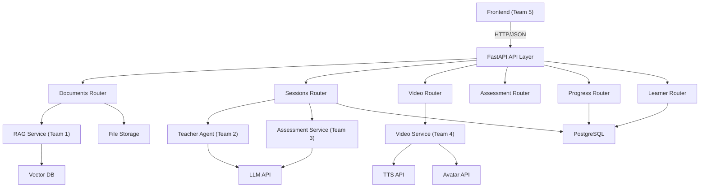
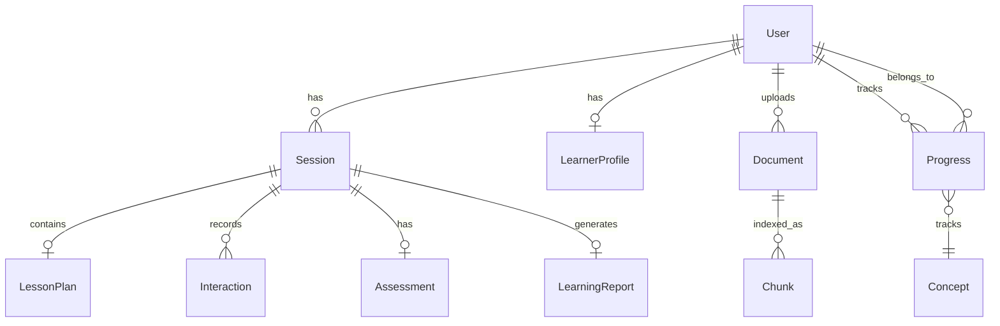

# Team 6 — Backend, Database, Integration & Deployment Engineer

## 1. Role / Mission

Make every module work as **one reliable application** and deploy it. You are the integration backbone — you own the FastAPI application, database schema, API routes, session management, learner profiles, authentication, file storage, and deployment. Every other team depends on you to expose their work through a unified API. You are the **glue** that holds the system together.

## 2. Scope

### What you OWN

- FastAPI application setup, configuration, and middleware (`backend/app/main.py`, `backend/app/core/`)
- All API route handlers (`backend/app/api/`)
- Database models and migrations (`backend/app/models/`)
- Pydantic schemas for request/response validation (`backend/app/schemas/`)
- Session management (create, start, progress, complete)
- Learner profile and progress persistence (`backend/app/services/learner/`)
- User authentication (registration, login, JWT tokens)
- File upload handling and storage
- Environment configuration (`.env`, `config.py`)
- Docker and deployment (`docker-compose.yml`, Dockerfiles)
- Integration testing (full end-to-end journey)
- CORS, logging, error handling middleware

### What you do NOT own

- RAG pipeline internals — Team 1 (you call their functions)
- Teacher Agent / lesson planning logic — Team 2 (you call their functions)
- Question generation / evaluation / adaptation logic — Team 3 (you call their functions)
- TTS / avatar / video generation logic — Team 4 (you call their functions)
- Frontend UI — Team 5 (they call your API)

### Dependencies

| Dependency | Provider | What you need |
|---|---|---|
| `IngestionPipeline` | Team 1 | `ingest_document(file_path, doc_id, ...)` |
| `Retriever` | Team 1 | `search(query, doc_id, top_k)` |
| `LessonPlanner` | Team 2 | `generate(topic, context, learner)` |
| `TeacherAgent` | Team 2 | `get_next_action(session, evaluation)`, `generate_script(segment)` |
| `QuestionGenerator` | Team 3 | `generate(concept, level, language, type)` |
| `Evaluator` | Team 3 | `evaluate(question, answer)` |
| `ReportGenerator` | Team 3 | `generate(session_id, evaluations, progress)` |
| `VideoGenerator` | Team 4 | `generate(request)`, `get_status(segment_id)` |

## 3. Mandatory Tasklist (P0)

### FastAPI Application

- [ ] Configure FastAPI with lifespan (startup/shutdown)
- [ ] Configure CORS middleware (allow `http://localhost:3000`)
- [ ] Add global exception handler (return JSON errors, not HTML)
- [ ] Add request logging middleware
- [ ] Add request validation via Pydantic schemas
- [ ] Configure settings via `pydantic-settings` from `.env`
- [ ] Health check endpoints (`/`, `/api/health`)

### Database Models

Create SQLAlchemy models for:

- [ ] `User` — id, email, hashed_password, created_at
- [ ] `LearnerProfile` — id, user_id, level, language, goals, preferences, strong_concepts, weak_concepts, learning_history
- [ ] `Document` — id, user_id, filename, file_type, file_size, status, outline (JSON), chunk_count, created_at
- [ ] `Session` — id, user_id, topic, document_id, language, learner_level, duration_minutes, goal, status, lesson_plan (JSON), lesson_state (JSON), created_at
- [ ] `Interaction` — id, session_id, segment_id, question_id, student_answer, evaluation (JSON), feedback, created_at
- [ ] `Assessment` — id, session_id, questions (JSON), answers (JSON), score, created_at
- [ ] `Progress` — id, user_id, topic, concept, mastery, attempts, correct_count, misconceptions (JSON), status
- [ ] `LearningReport` — id, session_id, total_questions, correct_answers, score, strong_concepts (JSON), weak_concepts (JSON), misconceptions (JSON), revision_recommendations (JSON), next_topic

Database setup:
- [ ] Configure async PostgreSQL connection via `asyncpg`
- [ ] Create all tables on startup via `init_db()`
- [ ] Use Alembic for migrations (at least initial migration)

### API Routes — Documents

- [ ] `POST /api/documents/upload` — Accept file upload (multipart/form-data), validate type/size, call Team 1's ingestion pipeline, return `DocumentUploadResponse`
- [ ] `GET /api/documents/{id}/outline` — Return document outline and processing status, return `DocumentOutlineResponse`

### API Routes — Sessions

- [ ] `POST /api/sessions` — Create a new teaching session with learner parameters, return `SessionResponse`
- [ ] `GET /api/sessions/{id}` — Get session details, return `SessionResponse`
- [ ] `POST /api/sessions/{id}/start` — Trigger lesson plan generation (call Team 2), return `SessionStartResponse`
- [ ] `POST /api/sessions/{id}/answer` — Submit student answer (call Team 3 evaluator), return `AnswerResponse`
- [ ] `GET /api/sessions/{id}/report` — Get learning report (call Team 3 report generator), return `LearningReportResponse`

### API Routes — Video

- [ ] `POST /api/video/generate` — Trigger video generation for a segment (call Team 4), return `VideoResult`
- [ ] `GET /api/video/{segment_id}/status` — Poll video generation status, return `VideoStatusResponse`

### API Routes — Assessment

- [ ] `POST /api/assessment/{session_id}/final` — Trigger final assessment generation (call Team 3), return list of questions
- [ ] `POST /api/assessment/{session_id}/submit` — Submit final assessment answers, return results + trigger report

### API Routes — Progress & Learner

- [ ] `GET /api/progress` — Get overall progress for the current user, return `OverallProgressResponse`
- [ ] `GET /api/progress/{session_id}` — Get per-session progress, return list of `ProgressResponse`
- [ ] `POST /api/learner/profile` — Create learner profile, return `LearnerProfile`
- [ ] `GET /api/learner/profile` — Get current user's learner profile
- [ ] `PUT /api/learner/profile` — Update learner profile

### Learner Profile Service

- [ ] Create learner profile from session parameters
- [ ] Update profile after each session (add new strong/weak concepts)
- [ ] Track learning history across sessions
- [ ] Provide profile data to Teacher Agent for personalization

### Progress Tracking Service

- [ ] After each evaluation, update per-concept progress
- [ ] Calculate mastery: `correct_count / attempts`
- [ ] Track misconceptions per concept
- [ ] Update concept status: `not_started` / `in_progress` / `mastered` / `weak`
- [ ] Persist progress to database

### File Storage

- [ ] Save uploaded files to `data/uploads/{document_id}/`
- [ ] Create `data/uploads/` and `data/processed/` directories if they don't exist
- [ ] Do not expose raw file paths in API responses
- [ ] Track file processing status in Document model
- [ ] Handle file cleanup on document deletion

### Authentication

- [ ] User registration endpoint (`POST /api/auth/register`)
- [ ] User login endpoint (`POST /api/auth/login`) → return JWT token
- [ ] JWT token validation middleware
- [ ] Protect user-specific endpoints (sessions, progress, profile)
- [ ] Ensure one user cannot access another user's data
- [ ] For hackathon MVP: anonymous/demo mode is acceptable (skip auth if time-limited)

### Deployment

- [ ] `docker-compose.yml` working with PostgreSQL + backend + frontend
- [ ] Backend `Dockerfile` builds and runs correctly
- [ ] Frontend `Dockerfile` builds and serves correctly
- [ ] `.env.example` contains all required environment variables
- [ ] `data/` directories are volume-mounted in Docker
- [ ] Test the full stack via `docker-compose up --build`

## 4. P1 Important Tasks

- [ ] Background job queue (Celery or `asyncio.create_task`) for long-running tasks (document indexing, video generation)
- [ ] Redis/cache for session state and frequently accessed data
- [ ] Rate limiting on API endpoints
- [ ] API request/response logging and monitoring
- [ ] Swagger/OpenAPI documentation polish
- [ ] Database connection pooling optimization
- [ ] HTTPS / SSL configuration

## 5. P2 Optional Tasks

- [ ] Analytics dashboard (API usage, user activity)
- [ ] Webhook support for async video completion notifications
- [ ] Database backup automation
- [ ] Multi-region deployment
- [ ] API versioning (`/api/v1/...`)

## 6. Technical Architecture





## 7. Detailed Implementation Flow

### Document Upload Flow

```
POST /api/documents/upload (multipart/form-data)
  → Validate file type (PDF, DOCX, PPTX)
  → Validate file size (< 50 MB)
  → Generate document_id (UUID)
  → Save file to data/uploads/{document_id}/
  → Create Document record in DB (status: "uploaded")
  → Call Team 1: IngestionPipeline.run(file_path, document_id)
    → Updates status through: extracting → chunked → indexing → indexed
  → Return DocumentUploadResponse { id, filename, file_type, file_size, status }
```

### Session Lifecycle

```
POST /api/sessions (create)
  → Validate SessionCreate input
  → Create Session record (status: "created")
  → Create/update LearnerProfile
  → Return SessionResponse

POST /api/sessions/{id}/start
  → Load session from DB
  → If document_id: get relevant chunks from Team 1
  → Call Team 2: LessonPlanner.generate(topic, context, learner)
  → Store LessonPlan in session record
  → Initialize TeacherState in lesson_state
  → Trigger video generation for first segment (Team 4)
  → Set status: "active"
  → Return SessionStartResponse { session_id, lesson_plan, first_segment }

POST /api/sessions/{id}/answer
  → Load session + current state
  → Call Team 3: Evaluator.evaluate(question, answer)
  → Store Interaction record
  → Call Team 3: AdaptationEngine.recommend(evaluation, progress)
  → Call Team 2: TeacherAgent.get_next_action(session, evaluation)
  → Update TeacherState
  → Update Progress for the concept
  → If adaptation needed: generate new script + trigger video
  → If all concepts done: trigger final assessment
  → Return AnswerResponse { evaluation, feedback, next_question, adaptation }

GET /api/sessions/{id}/report
  → Load session + all interactions
  → Call Team 3: ReportGenerator.generate(session_id, evaluations, progress)
  → Store LearningReport record
  → Update LearnerProfile (strong/weak concepts)
  → Return LearningReportResponse
```

### Integration Orchestration

The `/api/sessions/{id}/answer` endpoint is the **most complex integration point**. It orchestrates:

1. Team 3 evaluation
2. Team 3 adaptation
3. Team 2 teacher decision
4. Team 4 video generation (if adapting)
5. Database updates (interaction, progress, session state)

## 8. Technology Recommendations

| Technology | Role | Why | Replaceable? |
|---|---|---|---|
| **FastAPI** | Web framework | Already in project, async, auto-docs, Pydantic integration | No |
| **SQLAlchemy 2.0 (async)** | ORM | Already in project, async PostgreSQL support | No |
| **asyncpg** | PostgreSQL driver | Already in project, fast async driver | No |
| **Alembic** | Migrations | Already in project, standard for SQLAlchemy | No |
| **PostgreSQL 16** | Database | Already in docker-compose, reliable, JSON support | No |
| **python-jose** | JWT tokens | Already in project | Yes → PyJWT |
| **passlib + bcrypt** | Password hashing | Already in project | No |
| **Docker + Docker Compose** | Deployment | Already configured | No |
| **pydantic-settings** | Configuration | Already in project, loads `.env` | No |

> **All technologies are already in the project.** No new dependencies needed for Team 6 core work.

## 9. Interfaces / API Contracts

### Document Upload

**Request**: `POST /api/documents/upload` — `multipart/form-data` with `file` field

**Response** (`DocumentUploadResponse`):
```json
{
  "id": "doc_abc123",
  "filename": "physics_textbook.pdf",
  "file_type": "pdf",
  "file_size": 2456789,
  "status": "uploaded"
}
```

### Session Create

**Request**: `POST /api/sessions`
```json
{
  "topic": "Ohm's Law",
  "document_id": null,
  "language": "hi",
  "learner_level": "beginner",
  "duration_minutes": 20,
  "goal": "Understand basic circuits"
}
```

**Response** (`SessionResponse`):
```json
{
  "id": "sess_abc123",
  "topic": "Ohm's Law",
  "document_id": null,
  "language": "hi",
  "learner_level": "beginner",
  "duration_minutes": 20,
  "status": "created",
  "lesson_plan": null,
  "lesson_state": null
}
```

### Session Start

**Request**: `POST /api/sessions/{id}/start` (no body)

**Response** (`SessionStartResponse`):
```json
{
  "session_id": "sess_abc123",
  "lesson_plan": {
    "title": "ओम का नियम",
    "duration_minutes": 20,
    "language": "hi",
    "learner_level": "beginner",
    "segments": [...]
  },
  "first_segment": {
    "id": "seg_1",
    "concept": "voltage",
    "minutes": 4,
    "explanation": "...",
    "example": "...",
    "visual_type": "diagram",
    "checkpoint": false
  },
  "message": "Lesson plan generated. Starting lesson..."
}
```

### Answer Submission

**Request**: `POST /api/sessions/{id}/answer`
```json
{
  "question_id": "q_seg3_1",
  "answer": "करंट बढ़ेगा",
  "concept": "resistance"
}
```

**Response** (`AnswerResponse`):
```json
{
  "evaluation": {
    "question_id": "q_seg3_1",
    "correct": false,
    "score": 0.0,
    "concept": "resistance",
    "misconception": "Student thinks resistance increases current",
    "confidence": 0.94,
    "next_action": "use_analogy",
    "difficulty": "easy"
  },
  "feedback": "यह सही नहीं है। प्रतिरोध बढ़ने से करंट कम होता है...",
  "next_question": null,
  "adaptation": {
    "action": "use_analogy",
    "difficulty": "easy",
    "reason": "Second failure on resistance concept"
  }
}
```

### Error Response Format (consistent across all endpoints)

```json
{
  "detail": "Document not found",
  "status_code": 404
}
```

## 10. Data Structures

### Database Models (SQLAlchemy)

```python
# backend/app/models/user.py
class User(Base):
    __tablename__ = "users"
    id: Mapped[str] = mapped_column(String, primary_key=True, default=uuid4_str)
    email: Mapped[str] = mapped_column(String, unique=True, index=True)
    hashed_password: Mapped[str] = mapped_column(String)
    created_at: Mapped[datetime] = mapped_column(DateTime, default=utcnow)

# backend/app/models/session.py
class Session(Base):
    __tablename__ = "sessions"
    id: Mapped[str] = mapped_column(String, primary_key=True, default=uuid4_str)
    user_id: Mapped[str] = mapped_column(ForeignKey("users.id"))
    topic: Mapped[str | None] = mapped_column(String, nullable=True)
    document_id: Mapped[str | None] = mapped_column(ForeignKey("documents.id"), nullable=True)
    language: Mapped[str] = mapped_column(String, default="en")
    learner_level: Mapped[str] = mapped_column(String, default="beginner")
    duration_minutes: Mapped[int] = mapped_column(Integer, default=20)
    goal: Mapped[str | None] = mapped_column(String, nullable=True)
    status: Mapped[str] = mapped_column(String, default="created")  # created | active | completed
    lesson_plan: Mapped[dict | None] = mapped_column(JSON, nullable=True)
    lesson_state: Mapped[dict | None] = mapped_column(JSON, nullable=True)
    created_at: Mapped[datetime] = mapped_column(DateTime, default=utcnow)

# backend/app/models/progress.py
class Progress(Base):
    __tablename__ = "progress"
    id: Mapped[str] = mapped_column(String, primary_key=True, default=uuid4_str)
    user_id: Mapped[str] = mapped_column(ForeignKey("users.id"))
    topic: Mapped[str] = mapped_column(String)
    concept: Mapped[str | None] = mapped_column(String, nullable=True)
    mastery: Mapped[float] = mapped_column(Float, default=0.0)
    attempts: Mapped[int] = mapped_column(Integer, default=0)
    correct_count: Mapped[int] = mapped_column(Integer, default=0)
    misconceptions: Mapped[list] = mapped_column(JSON, default=list)
    status: Mapped[str] = mapped_column(String, default="not_started")
```

### Session Status Values

```python
SESSION_STATUSES = ["created", "active", "completed", "error"]
```

### Document Status Values

```python
DOCUMENT_STATUSES = ["uploaded", "extracting", "extracted", "chunked", "indexing", "indexed", "error"]
```

## 11. Prompt / AI Design

Team 6 does NOT directly interact with LLMs. All AI logic is delegated to Teams 1-4 service functions. No prompt design needed for this team.

## 12. Error Handling

### API Error Responses

| Failure | Status Code | Response |
|---|---|---|
| Invalid file type | 400 | `{ "detail": "Unsupported file type. Accepted: PDF, DOCX, PPTX" }` |
| File too large | 413 | `{ "detail": "File exceeds maximum size of 50 MB" }` |
| Session not found | 404 | `{ "detail": "Session not found" }` |
| Document not found | 404 | `{ "detail": "Document not found" }` |
| Session not started | 400 | `{ "detail": "Session has not been started. Call POST /sessions/{id}/start first" }` |
| Invalid session state | 400 | `{ "detail": "Session is already completed" }` |
| Missing topic and document_id | 400 | `{ "detail": "Either topic or document_id must be provided" }` |
| Authentication failed | 401 | `{ "detail": "Invalid credentials" }` |
| Unauthorized access | 403 | `{ "detail": "Access denied" }` |
| LLM service failure | 502 | `{ "detail": "AI service temporarily unavailable. Please try again." }` |
| Database connection failure | 500 | `{ "detail": "Internal server error" }` |
| Video generation failure | 500 | `{ "detail": "Video generation failed", "fallback": "placeholder" }` |

### Global Exception Handler

```python
@app.exception_handler(Exception)
async def global_exception_handler(request, exc):
    logger.error(f"Unhandled error: {exc}", exc_info=True)
    return JSONResponse(
        status_code=500,
        content={"detail": "Internal server error"}
    )
```

## 13. Testing Checklist

### Unit Tests

- [ ] `POST /api/documents/upload` — valid PDF returns 200 + document_id
- [ ] `POST /api/documents/upload` — invalid file type returns 400
- [ ] `POST /api/documents/upload` — file too large returns 413
- [ ] `POST /api/sessions` — valid input creates session
- [ ] `POST /api/sessions` — missing topic and document_id returns 400
- [ ] `POST /api/sessions/{id}/start` — generates lesson plan
- [ ] `POST /api/sessions/{id}/answer` — returns evaluation
- [ ] `GET /api/sessions/{id}/report` — returns learning report
- [ ] `GET /api/progress` — returns progress data
- [ ] Authentication: valid token grants access
- [ ] Authentication: invalid token returns 401
- [ ] Authentication: user A cannot access user B's sessions

### Integration Tests

- [ ] Full journey (see section 14 below)
- [ ] Document upload → index → create session with document → teach from document
- [ ] Multiple sessions for same user → progress accumulates correctly

### Edge Cases

- [ ] Concurrent session creation from same user
- [ ] Session started twice → returns existing plan (idempotent)
- [ ] Answer submitted to completed session → returns error
- [ ] Very long topic string (1000+ chars) → truncated or rejected
- [ ] Database connection lost mid-request → returns 500 with message

### End-to-End Integration Test

```
1. POST /api/documents/upload (PDF) → 200
2. GET /api/documents/{id}/outline → status: "indexed"
3. POST /api/sessions { topic, document_id, ... } → 200
4. POST /api/sessions/{id}/start → lesson_plan returned
5. POST /api/video/generate { segment } → 200
6. GET /api/video/{seg}/status → "completed"
7. POST /api/sessions/{id}/answer (wrong) → misconception detected
8. POST /api/sessions/{id}/answer (correct) → continue
9. POST /api/assessment/{id}/final → questions returned
10. POST /api/assessment/{id}/submit → results
11. GET /api/sessions/{id}/report → full report
12. GET /api/progress → updated progress
13. Reload page → GET /api/sessions/{id} → data persists
```

## 14. Demo Requirements

Team 6 is responsible for the **entire system working as one**. Before the demo:

1. **Deploy the complete stack** — Backend + Frontend + Database all running
2. **All API endpoints functional** — Every route returns expected data
3. **Database persists data** — Reload the page → session and progress still exist
4. **Error handling works** — Invalid inputs return clean error messages, not stack traces
5. **The full demo flow works end-to-end** without manual intervention

### Pre-Demo Checklist

- [ ] `docker-compose up --build` starts all services
- [ ] Frontend loads at `http://localhost:3000`
- [ ] Backend API responds at `http://localhost:8000`
- [ ] Database has tables created
- [ ] `.env` has all required API keys configured
- [ ] Upload a test PDF → it gets indexed
- [ ] Create a test session → lesson plan generated
- [ ] Submit a test answer → evaluation returned
- [ ] Demo script rehearsed at least once

## 15. Definition of Done

- [ ] FastAPI application starts without errors
- [ ] All database models created and migrations run
- [ ] All P0 API routes return correct responses
- [ ] Document upload → indexing pipeline works
- [ ] Session lifecycle works: create → start → answer → report
- [ ] Video generation triggered and status tracked
- [ ] Progress persisted across sessions
- [ ] Authentication protects user data (or demo mode works)
- [ ] CORS configured for frontend
- [ ] Docker deployment works (`docker-compose up`)
- [ ] `.env.example` documents all required variables
- [ ] Global error handler returns JSON (not HTML/stack traces)
- [ ] End-to-end integration test passes
- [ ] The complete system works from student input to learning report

## 16. Handoff to Other Teams

| Artifact | Consumer | What they need |
|---|---|---|
| API endpoints (all of `/api/*`) | Team 5 | Frontend calls these endpoints |
| `IngestionPipeline` call in upload route | Team 1 | You call their function from your route handler |
| `LessonPlanner` call in session start | Team 2 | You call their function from your route handler |
| `Evaluator` call in answer route | Team 3 | You call their function from your route handler |
| `VideoGenerator` call in video route | Team 4 | You call their function from your route handler |
| Database models | All teams | Shared data persistence |
| `.env` configuration | All teams | API keys, DB URLs |
| Docker deployment | All teams | Running environment |

### What you need from each team

| Team | What they deliver | How you use it |
|---|---|---|
| Team 1 | `IngestionPipeline.run()`, `Retriever.search()` | Call from document and session routes |
| Team 2 | `LessonPlanner.generate()`, `TeacherAgent.get_next_action()` | Call from session routes |
| Team 3 | `Evaluator.evaluate()`, `QuestionGenerator.generate()`, `ReportGenerator.generate()` | Call from answer and report routes |
| Team 4 | `VideoGenerator.generate()`, `VideoGenerator.get_status()` | Call from video routes |

### Integration Pattern

```python
# Example: POST /api/sessions/{id}/answer
async def submit_answer(session_id: str, submission: AnswerSubmission, db: AsyncSession):
    session = await get_session(db, session_id)
    
    # Team 3: Evaluate
    evaluation = await evaluator.evaluate(submission.question_id, submission.answer, submission.concept)
    
    # Team 3: Adapt
    adaptation = await adaptation_engine.recommend(evaluation, concept_progress)
    
    # Team 2: Teacher decision
    next_action = await teacher_agent.get_next_action(session, evaluation)
    
    # Persist
    await save_interaction(db, session_id, submission, evaluation)
    await update_progress(db, session.user_id, evaluation)
    await update_session_state(db, session_id, next_action)
    
    return AnswerResponse(evaluation=evaluation, feedback=evaluation.feedback, ...)
```

## 17. Performance / Cost Considerations

| Concern | Mitigation |
|---|---|
| Database connections | Use SQLAlchemy async session pool (default 5 connections). Sufficient for hackathon. |
| File storage | Local filesystem via `data/` directory. No cloud storage needed for MVP. |
| API latency | Most latency comes from LLM calls (Teams 2, 3) and video generation (Team 4). Backend routing overhead is negligible. |
| Concurrent users | Not a concern for hackathon demo (1-2 users max). |
| Docker image size | Keep images small. Use `python:3.13-slim` and `node:22-alpine` base images. |
| Database size | ~1 MB per session. PostgreSQL default storage is more than enough. |

## 18. Security / Privacy

- **Never commit `.env`** — it's in `.gitignore`
- Store passwords hashed with bcrypt (via `passlib`)
- JWT tokens expire after configured time (`ACCESS_TOKEN_EXPIRE_MINUTES`)
- Validate file uploads: check extension AND content type
- Sanitize filenames before storage (remove path traversal characters: `../`, `..\\`)
- Do not expose internal file paths in API responses
- Do not expose database error details to clients (catch and return generic message)
- User data isolation: all queries filter by `user_id`
- API keys for LLM/TTS/Avatar stored in `.env`, accessed via `settings`

## 19. Known Limitations

- **No horizontal scaling** — single backend instance in MVP
- **No background job queue** — document indexing and video generation run in the request lifecycle (may cause timeouts for large files)
- **No WebSocket** — video status is polled, not pushed
- **No email verification** — registration is minimal
- **No password reset** — not implemented in MVP
- **No API rate limiting** — could be abused in production
- **SQLite fallback not tested** — only PostgreSQL is supported
- **No database backups** — data loss risk if Docker volume is deleted
- **Session state in JSON column** — not ideal for complex queries, but sufficient for MVP

## 20. Suggested Implementation Order

| Phase | Tasks | Est. Time |
|---|---|---|
| **Phase 1 — Foundation** | FastAPI app, config, database models, init_db, health check | 3-4 hours |
| **Phase 2 — Auth** | User registration, login, JWT middleware (or skip for demo mode) | 2-3 hours |
| **Phase 3 — Document Routes** | Upload + outline endpoints, call Team 1 pipeline | 2-3 hours |
| **Phase 4 — Session Routes** | Create + start + answer + report endpoints, call Teams 2-3 | 4-5 hours |
| **Phase 5 — Video Routes** | Generate + status endpoints, call Team 4 | 2 hours |
| **Phase 6 — Progress/Learner** | Progress tracking, learner profile, history | 2-3 hours |
| **Phase 7 — Integration** | Wire up all team services, test end-to-end | 3-4 hours |
| **Phase 8 — Deployment** | Docker, docker-compose, .env, test production flow | 2-3 hours |
| **Phase 9 — Demo Prep** | Full integration test, fix bugs, rehearse demo | 2 hours |

> **Phase 4 (Session Routes) is the most complex.** The `/answer` endpoint orchestrates 3 teams. Start it early and test with mocks before real services are ready.

---

## Files to Create / Modify

```
backend/app/
├── main.py                     ← FastAPI app (update routers)
├── core/
│   ├── config.py               ← Settings from .env
│   ├── database.py             ← Async DB engine + session
│   ├── dependencies.py         ← Dependency injection (get_db, get_user)
│   └── security.py             ← JWT + password hashing
├── models/
│   ├── __init__.py             ← Import all models
│   ├── user.py
│   ├── document.py
│   ├── session.py
│   ├── interaction.py
│   ├── assessment.py
│   ├── learner.py
│   └── progress.py
├── schemas/
│   ├── __init__.py
│   ├── document.py
│   ├── lesson.py
│   ├── evaluation.py
│   ├── video.py
│   ├── learner.py
│   └── progress.py
├── api/
│   ├── documents.py            ← Document routes
│   ├── sessions.py             ← Session routes (most complex)
│   ├── assessment.py           ← Assessment routes
│   ├── video.py                ← Video routes
│   ├── progress.py             ← Progress routes
│   └── learner.py              ← Learner profile routes
└── services/
    └── learner/
        ├── profile.py          ← Learner profile CRUD
        ├── progress.py         ← Progress tracking
        └── history.py          ← Learning history

docker-compose.yml              ← Update if needed
.env.example                    ← Update with all variables
backend/Dockerfile              ← Update if needed

backend/tests/
├── test_documents_api.py
├── test_sessions_api.py
├── test_assessment_api.py
├── test_progress_api.py
└── test_integration.py         ← Full end-to-end test
```

---

## Instructions for AI Coding Assistants

1. Read the root `README.md` before modifying any code.
2. Read ALL shared contracts in `packages/types/` — your API responses must match these schemas exactly.
3. Read existing code in `backend/app/` before creating new files — many files already exist.
4. All backend code goes in `backend/app/`. Do not modify frontend code (`apps/web/`).
5. Do not modify other teams' service directories (`rag/`, `teacher/`, `assessment/`, `video/`). You CALL their functions from your API routes.
6. Use `backend/app/core/config.py` → `settings` for all configuration. Never hardcode values.
7. Keep secrets in `.env`. Update `.env.example` when adding new environment variables.
8. Follow existing naming conventions: snake_case for files/functions, PascalCase for classes.
9. Use Pydantic schemas (`backend/app/schemas/`) for ALL request/response validation.
10. Use SQLAlchemy async sessions for ALL database operations.
11. Return consistent error responses: `{ "detail": "message" }` with appropriate HTTP status codes.
12. Add tests in `backend/tests/` for every new API route.
13. Do not silently change API contracts — coordinate with Team 5 (frontend).
14. Log important events at INFO level (session creation, answer submission, errors).
15. Before finishing, provide:
    - Files changed
    - API endpoints implemented
    - Database models created
    - Tests run and their results
    - Remaining issues
    - Integration status with each team's service
